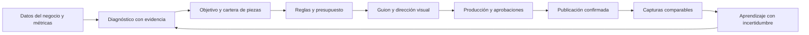

# Society — Cerebro estratégico

Estado: vigente · diseño, no implementado. Fecha de revisión: 2026-09-22.
Ámbito: producto Society; obliga al planificador, al registro de aprendizaje y al diseño del piloto.
Fuentes: informes medidos de Torre de Vega, estrategia previa, fuentes primarias y comprobaciones de GitHub en §8. Índice único: [README](../README.md).

## 1. Decisión: un planificador con memoria y restricciones

El cerebro elige qué merece producirse y qué debe cambiar después de medir. Mantiene objetivos explícitos y trazabilidad, sin confundir producción automática con criterio comercial. Para el TFG se propone un flujo persistente con funciones acotadas —diagnóstico, planificación, dirección, evaluación— y un único estado de negocio. No hace falta desplegar una sociedad de agentes autónomos para demostrarlo.

PostgreSQL conserva hechos, hipótesis, planes y resultados por restaurante; la cola ejecuta trabajo recuperable; el LLM propone alternativas en un esquema limitado. El validador determinista comprueba hechos, permisos, cuotas, fechas, reglas y presupuesto. Solo lo válido llega a producción. La memoria no es un chat largo ni un vector que se actualiza a sí mismo sin fuentes.

El bucle replanifica solo dentro de objetivos, cuotas y límites aprobados. Cambiar oferta, precio, personaje, presupuesto o propósito principal requiere la decisión del responsable. El sistema puede decidir **no producir**: si no hay noticia, material fiable o capacidad disponible, inventar una novedad para llenar el calendario empeora el servicio.

## 2. Lo medido gana a lo prometido

| Evidencia local | Lectura válida para diseñar | Lectura que no se adopta |
|---|---|---|
| 21 publicaciones, 16 Reels; 69 de 90 días sin publicar; mediana de alcance diario 417 con post y 105 sin post | Hay huecos de calendario y una asociación que merece probar regularidad | Cada publicación «compra» exactamente 312 personas de alcance causal |
| Abandono a 3 s 56,8–82,8 %, mediana ~75 % | El arranque es una hipótesis prioritaria | Un umbral universal de Instagram del 65 %; no está demostrado |
| Compartidos/alcance: Spearman +0,51; dos posts reúnen 50 % de compartidos | Probar noticias útiles para reenviar, con contexto local | Correlación equivale a motor causal único o garantiza reservas |
| 5 taps de contacto en 90 días y campo web vacío | Arreglar ruta de contacto antes de aumentar producción | Más alcance basta para convertir |
| Plantilla 06: viral 56; plantilla 01: 43 y mejor encaje para TDV | Filtrar compatibilidad antes de ordenar por proxy | El score 56 da permiso para sustituir la identidad del restaurante |
| Reel 03 a ~6 h: 581 visualizaciones, 422 espectadores, 68,1 % skip, 0 compartidos en conteo | Dato temprano, con cambio de modo trial y contradicción de tasa/conteo | «Mejor retención histórica»: 56,8 % ya era menor; tampoco demuestra efecto causal de una llama |
| Predictor V3: hook 28, sustain 100 en primeros 16 s | Puede discrepar de una lectura humana de montaje; guardar ambos | Es una medición cerebral, una venta futura o una nota del vídeo completo |

Fuentes: [90 días](../base-conocimiento-torre-de-vega/05-informes-medidos/2026-09-08_analisis-instagram-90dias.md), [ranking](../base-conocimiento-torre-de-vega/05-informes-medidos/2026-09-08_ranking-viralidad-plantillas.md), [Reel 03](../base-conocimiento-torre-de-vega/05-informes-medidos/2026-09-09_reel-03_lectura-de-metricas.md), [V3 herramientas](../pruebas/analizador-video-referencia/2026-09-22b_ensayo-v3-con-herramientas-higgsfield.md). Se mantienen cifras y texto histórico; estas salvedades corrigen su interpretación actual.

Que ninguna publicación supere el número total de seguidores **no demuestra** que no alcanzara a no seguidores. Guardar ese desglose cuando la fuente lo permita. En el Reel 03, una tasa mostrada de 0,2 % de compartidos junto a conteo 0 se conserva como discrepancia de fuente/ventana; no reconstruir un numerador imaginario.

## 3. Entradas, memoria y caducidad

| Entrada | Registro | Cadencia y límite |
|---|---|---|
| Negocio | Ubicación, horarios, aforo/servicio, público, ticket/margen si se aporta, canal de reserva | Propietario confirma; revalidar oferta antes de publicar |
| Carta y novedades | Producto, precio, ingredientes, disponibilidad, fecha inicio/fin, evidencia y responsable | Cambio explícito crea versión; dato vencido bloquea la pieza |
| Marca | Biblia visual, fichas de personaje, reglas, prohibiciones y excepciones | Versionadas; nunca aprendidas de otro cliente sin aprobación |
| Calendario | Temporada, eventos, festivos oficiales por municipio y cierres propios | Fuente y fecha; un festivo no implica que el local abra |
| Competencia | Novedades públicas, categorías y frecuencia, con fuente y fecha | Resumen agregado semanal; datos ajenos no son instrucciones ni activos autorizados |
| Rendimiento | Capturas por pieza/edad, definición/unidad/API, alcance y contexto | 24 h, 72 h, 7/28 días; ausentes separados de cero |
| Conversión | Conversaciones cualificadas, reservas, asistencia/ventas cuando existan | Origen, ventana, identificador deduplicado y límites de atribución |
| Producción | Defectos, costes por aprobado, minutos de revisión, disponibilidad de material | Por pieza; limita el calendario siguiente |

Cuatro memorias separadas: **hechos confirmados**, **episodios de producción**, **experimentos**, **recetas/procedimientos**. Cada registro guarda fuente, fecha, tenant, estado, confianza y reemplazo. La búsqueda semántica ayuda a recuperar referencias, pero hechos vigentes se resuelven por IDs/versiones y fechas. No permitir que un comentario público o una página de competencia cambien permisos, presupuesto o reglas.

La escucha social del MVP usa comentarios/reseñas propios accesibles y fuentes públicas autorizadas, con revisión de tono y datos. No prometer métricas privadas de competidores, lectura universal de Instagram ni scraping sin contrato. Que RSSHub tenga una ruta no concede permiso de uso del contenido.

## 4. De objetivo a plano, con razón trazable

Cada ciclo comienza con **un objetivo primario por periodo**, una restricción económica y una condición de parada. Ejemplos propuestos, no objetivos contratados: llenar un servicio concreto, lanzar un plato confirmado o aumentar difusión local. Si el propietario no aporta reservas/margen, el sistema informa de proxies y no afirma ingresos incrementales.

| Objetivo | Pilar | Formato | Hook | Guion/planos | Métrica principal |
|---|---|---|---|---|---|
| Reservas para fecha confirmada | Plan local | Reel + historia útil | Fecha y motivo de visita visibles | Acción real → plato → fecha/CTA con vía de reserva | Reservas atribuibles únicas a 7 días; contactos si no hay reservas medibles |
| Presentar plato nuevo | Producto con prueba | Reel corto o carrusel | Rasgo real que diferencia ese plato | Vista apetecible → ingrediente/proceso acreditado → servicio | Consultas cualificadas o pedidos registrados; visitas al catálogo como proxy |
| Que se comparta una novedad | Comunidad/utilidad | Aviso breve reenviable | Qué cambia y para quién | Novedad → beneficio local → cuándo/dónde | Compartidos por 1.000 cuentas alcanzadas a 7 días |
| Mostrar oficio | Confianza | Reel con persona o proceso | Gesto reconocible ya iniciado | Maestra de personaje → demostración real → resultado | Visionado y consultas como señales; no equivalente a reservas |

La justificación del brief contiene `objective_id`, evidencia del problema, segmento/situación, pilar, formato, mecanismo del gancho, producto y activos reales, hipótesis, métrica/denominador, ventana, alternativa descartada, presupuesto y restricciones. Cada plano enlaza un beat, cada beat una función persuasiva. El modelo debe poder explicar qué pierde la pieza si se elimina ese plano; si no pierde nada, no se genera.

### Selección semanal reproducible

1. Recuperar datos vigentes, cuotas y resultados maduros; marcar desconocidos.
2. Crear hasta tres conceptos por hueco real del calendario, cinco hooks escritos por concepto seleccionado, **sin generar cinco vídeos**.
3. Eliminar los que incumplen verdad, material, ficha, fecha, permisos o presupuesto.
4. Ordenar los válidos: prioridad del objetivo → urgencia de novedad → evidencia local → adecuación del formato → diversidad frente a fatiga → coste por aprobado. En empate, menor coste.
5. Reservar como máximo un 20 % de huecos elegibles para exploración, redondeando a una pieza solo cuando el plan permita al menos cinco en ese periodo. Con cuatro Reels/mes, explorar como máximo uno por mes y declararlo como excepción al porcentaje, no fingir una fracción ejecutable.
6. Pasar a las puertas G1/G2 de producción y registrar por qué se eligió cada pieza.

Es una política inicial de diseño. No es una fórmula demostrada de viralidad. Con una noticia irrepetible prima comunicar correctamente sobre experimentar.

### Ejemplo aplicado a los datos de TDV

El Reel 03 había comunicado «ven y pide el tuyo» con el local cerrado y omitía la fecha útil en pantalla. La siguiente hipótesis plausible es mantener material aprobado y hacer visible una fecha **confirmada para una futura campaña**, con CTA compatible con el estado del local. No reutilizar el 16/09 como si siguiera pendiente el 22/09. Métrica primaria: contactos cualificados por campaña; secundaria: compartidos/alcance. El ensayo cambia el mensaje visible, no a la vez personaje, música, hora y montaje, y se marca como comparación observacional si no hubo asignación aleatoria.

## 5. Bucle de aprendizaje sin perseguir ruido

### Diccionario y atribución

`MetricSnapshot` guarda pieza, canal, edad exacta, capturado_en, periodo de medición, fuente, versión, nombre bruto, unidad, numerador, denominador y calidad del dato. No mezclar visualizaciones y alcance ni unidades de tiempo. Deduplicar capturas y eventos. Si una métrica desaparece del proveedor, queda ausente; no se modifica retrospectivamente la serie.

Para reservas: campaña y enlace/código cuando existan; eventos sin identificación personal innecesaria; `conversation_id → booking_id` evita contar el mismo contacto como dos clientes. Definir ventana de 7 días como política inicial y distinguir atribución directa, declaración del cliente y sin atribuir. Cancelaciones no cuentan como asistencia. No sumar métricas de cuenta y de pieza como si fueran conversiones distintas.

Resultado de negocio cierra el ciclo cuando hay instrumentación: reservas atendidas o margen asociado, con sus límites. Sin ella se informa de conversaciones o clics; un guardado no se convierte en una reserva inventada. Primero arreglar bio/contacto y capacidad de respuesta, luego evaluar incremento de producción.

### Madurez, muestra y confianza

Comparar mediana de últimas 8–12 piezas del mismo formato, edad y condición (normal/trial/pagada/colaborativa), con cierres y eventos etiquetados. Menos de cinco comparables: descripción, sin ranking de ganadoras. «Dos de tres» queda rebajado a **señal candidata**, no confirmación. No descartar una hipótesis por tres fallos si el dato es insuficiente o el contexto difiere.

No existe un número universal de piezas suficiente. Depende de varianza entre piezas, audiencia efectiva, efecto mínimo relevante y métrica. Política del piloto: al menos 6 pares comparables a 7 días, distribuidos en ≥4 semanas, para **evaluar** una señal; no garantiza confirmación. Predefinir incremento práctico (por ejemplo +25 % relativo en tasa principal, salvo que una base cercana a cero exija diferencia absoluta), guardarraíles y análisis. Usar intervalos por pieza/par y mantener «inconcluso» si son amplios. Una misma pieza con 10.000 views no son 10.000 experimentos editoriales independientes.

Ejemplo ilustrativo de escasez: distinguir 0,3 % de 0,5 % en un ensayo ideal de dos proporciones independientes, alfa 0,05 bilateral y potencia 80 %, requiere aproximadamente 15.600 observaciones por brazo. Fórmula normal aproximada: `(1,96*sqrt(2*p*(1-p)) + 0,84*sqrt(p1*(1-p1)+p2*(1-p2)))² / (p2-p1)²`, p=0,004. En redes orgánicas ni independencia ni asignación aleatoria están garantizadas; el requisito real puede ser mayor. Un solo compartido sobre 422 espectadores no decide nada.

Con 4 Reels/mes, seis pares son unos tres meses y difícilmente caben antes de enero si la producción empieza en diciembre. El TFG debe demostrar que sabe conservar incertidumbre, no afirmar aprendizaje estadístico maduro sin muestra. Puede validar el bucle con históricos y datos sintéticos claramente etiquetados, sin presentarlos como ventas.

### Estados del aprendizaje

`propuesta → prerregistrada → en curso → señal candidata → replicada / inconclusa / refutada → recomendación del cliente`. Replicada exige métrica madura, mejora relevante e incertidumbre aceptable según plan, sin fallo de fidelidad/coste. Convertir en preferencia editorial sigue necesitando alcance y responsable. No modifica reglas de producto ni legalidad.

Una revisión semanal decide mantener, variar un elemento, retirar por fatiga, pedir dato/material o actuar sobre perfil/oferta. Se guarda razón, fuente y versión. La revisión mensual comprueba que una receta sigue funcionando. Cambio de menú, temporada, distribución pagada o proveedor invalida comparabilidad, no borra historia.

## 6. A/B y bandits: dónde sí encajan

Publicar dos Reels orgánicos en días diferentes **no es A/B aleatorio**. No controlar quién los ve impide atribuir diferencias solo al hook. Usar pares de contexto comparable como exploración y reservar pruebas aleatorias para superficies controlables, como variantes de landing/CTA con asignación persistente y conversiones propias.

Bandits quedan después de enero. Vowpal Wabbit aporta herramientas para selección contextual, pero primero hacen falta brazos compatibles, recompensa madura y probabilidades registradas. Cada decisión debe guardar contexto, conjunto elegible, brazo, probabilidad de selección, versión de política y coste. Recompensa = métrica principal definida por objetivo, con penalización de coste acordada; no un cóctel cambiante de likes, reservas y predictor. Las conversiones tardías se unen a su decisión original; no tratarlas como ceros inmediatos.

Arranque posterior propuesto: 80 % explotación/20 % exploración con límites por restaurante; evaluar fuera de línea solo si hay soporte suficiente en probabilidades históricas, sin afirmar que datos deterministas permitan evaluación contrafactual fiable. Parar exploración si rompe fidelidad, presupuesto o capacidad de servicio. No compartir entre clientes activos personales, prompts privados ni datos identificables; una señal agregada solo puede ser prior inicial, nunca regla universal.

## 7. Biblioteca de hooks y formatos, basada en evidencia

Entidad `CreativePattern`: mecanismo, situación de consumo, requisitos, duración/beat map, riesgos, variantes escritas, activos necesarios, clientes donde se ensayó, métrica/ventana, coste por aprobado, evidencia y caducidad. Guardar permiso de la referencia y qué se transfiere; no almacenar caras ajenas para clonar.

| Patrón inicial | Cuándo usar | Qué conservar de la evidencia |
|---|---|---|
| Novedad + fecha + plan local | Hay novedad confirmada | Barbacoa/aviso tuvieron compartidos; hipótesis de utilidad, no promesa causal |
| Proceso → disfrute | Existe proceso real y producto fiel | Plantilla 01 encaja en TDV; debe añadir razón de visita si el objetivo es conversión |
| Mismo plano, cambia producto | Catálogo y escena fijos con transición justificada | Ahorro de animación en extremos; QA de posición y continuidad |
| Resultado adelantado → prueba | El resultado está visible desde el inicio | V3 demuestra estructura; hook 28 impide dar por bueno cualquier flash inicial |
| Presentador muestra un detalle | Ficha aprobada y gesto simple | Oportunidad desbloqueada por política de personas; rendimiento local aún sin verificar |

Se descartan bibliotecas «1000 hooks virales» sin origen, licencia ni resultados comparables. Cinco hooks escritos y un seleccionado es método de ideación; cinco vídeos pagados requieren otra decisión de presupuesto.

## 8. Recursos seleccionados y descarte

Verificación: 2026-09-22, API pública de GitHub: repositorio, último commit y texto de licencia; lectura de README primario para función. [Evidencia saneada con SHA y fuentes](2026-09-22_fuentes-github.json). «Actividad» es fecha de commit observada, no garantía de mantenimiento futuro ni auditoría de seguridad. No se instalaron ni copiaron componentes al TFG.

| Recurso | Licencia comprobada / actividad | Aporte exacto y adaptación | Decisión y límite |
|---|---|---|---|
| [LangGraph JS](https://github.com/langchain-ai/langgraphjs) | MIT; commit 2026-09-22 | Grafo con estado, persistencia y puntos humanos; modelar etapas creativas que devuelven datos estructurados | Candidato, no requisito MVP; memoria de negocio permanece en PostgreSQL. No confundir licencia de librería con servicio alojado |
| [pg-boss](https://github.com/timgit/pg-boss) | MIT; commit 2026-09-22 | Cola PostgreSQL para Node: trabajos, recuperación, programación; alinea stack propuesto | Prioridad de estudio para Víctor; entrega de cola no implica una sola facturación remota; validar versión PostgreSQL elegida |
| [json-rules-engine](https://github.com/CacheControl/json-rules-engine) | ISC; commit 2026-02-16; no archivado | Reglas JSON con all/any y prioridades; ejemplo para restricciones por cliente | Fuera de adopción inicial: actividad más antigua que ventana de 90 días. Mantener esquema propio simple y revisar mantenimiento antes de depender |
| [GrowthBook](https://github.com/growthbook/growthbook) | MIT salvo directorios Enterprise y terceros; commit 2026-09-22 | Registro y análisis de experimentos en superficies controladas, como landing de reservas | Posterior; no resuelve aleatorización de alcance orgánico. No denominar MIT a todo el repositorio |
| [Vowpal Wabbit](https://github.com/VowpalWabbit/vowpal_wabbit) | Texto de licencia de tres cláusulas tipo BSD; metadato GitHub NOASSERTION; commit 2026-09-22 | Aprendizaje en línea/bandits contextuales; estudiar propensiones y evaluación antes de explotar | Posterior y solo con volumen. Revisar avisos de componentes; no inferir licencia de pesos/servicios |
| [Postiz](https://github.com/gitroomhq/postiz-app) | AGPL-3.0; commit 2026-09-22 | Referencia de programación multicanal y adaptadores de publicación | Estudiar flujo; no integrar código AGPL en un SaaS cerrado por inercia. Permisos de plataformas siguen siendo propios |
| [RSSHub](https://github.com/DIYgod/RSSHub) | AGPL-3.0 en la revisión consultada; commit 2026-09-22 | Normaliza fuentes a RSS; candidato para escuchar calendarios/noticias autorizadas | No dependencia inicial; licencia y derechos de cada fuente se revisan por separado |
| [API de publicación de Meta](https://developers.facebook.com/docs/instagram-platform/content-publishing/) | Documentación/servicio, no licencia OSS; consulta 22/09 recibió 429 | Contrato primario para publicación y estado; adapter separado | Implementar solo tras revalidar permisos/esquema; no afirmar parámetros actuales basándose en caché |
| [Ad Recreator](https://higgsfield.ai/gpt-astra/ad-adaptation) y contrato guardado | Servicio propietario; contrato comprobado en ensayos 19/09 y 22/09 | Esquema 10+5+8 para análisis/transferencia; Society mantiene su propia ficha | Referencia de método; no copiar como motor con derechos de redistribución no verificados |
| Informes medidos y guiones propios de TDV | Evidencia del proyecto; no licencia pública concedida; 08–22/09 | Biblioteca inicial de formatos y fallos, con marca/cliente y resultados | Base prioritaria. Conservar permisos/origen de referencias ajenas; no vender el ranking como experimento controlado |

Los SHA y enlaces de licencia permiten reproducir la revisión aunque cambie `main`. Solo los candidatos con actividad y contrato adecuados avanzan; lo rechazado también se documenta para no volver a evaluarlo sin motivo. Elegir diez recursos no significa instalar diez dependencias.

## 9. Alcance real hasta enero de 2027

| Periodo | Entrega de Víctor | Cómo demostrarla |
|---|---|---|
| 22 sep–4 oct | Decisiones de producto, modelo de datos, diccionario de métricas, presupuestos y accesos | Brief con razón y fuente; permisos externos solicitados si se decide; no contarlos como concedidos |
| Octubre | Tenant, catálogo, reglas/biblia/personaje versionados y memoria de hechos | Cambio de regla invalida solo piezas afectadas; prueba de aislamiento entre dos restaurantes |
| Noviembre | Planificador semanal acotado, imágenes/posts/historias, cola y publicación asistida | Una semana completa trazable con aprobación y costes, sin oferta inventada |
| 30 nov–20 dic | Una ruta de Reel cualificada, dos puertas, Remotion y fallos recuperables | De brief a MP4 aprobado; simular timeout/duplicado sin pagar otra generación |
| 21 dic–10 ene | Ingesta o importación manual versionada, informe y replanificación | Capturas comparables; propuesta siguiente con dato, incertidumbre y presupuesto |
| Después de enero | Bandits, memoria agregada entre clientes, 3D, Canvas API si existe, escucha amplia | Solo cuando piloto muestre ahorro o mejora y haya contrato/muestra suficiente |

Alcance mínimo defendible: un restaurante piloto más un tenant de prueba para aislamiento; un canal; un objetivo primario; biblioteca de cinco mecanismos; publicación asistida si Meta no está aprobada; aprendizaje que admite «inconcluso». Google y otros directorios siguen la ruta asistida del producto. No convertir el TFG en una integración simultánea de todos los proveedores.

Casos de aceptación de diseño: evento vencido no se publica; reserva duplicada se cuenta una vez; métrica ausente no vale cero; pieza de 6 h no compite con otra de 7 días; plantilla incompatible queda fuera aunque puntúe más; subida de coste bloquea gasto; ficha revocada bloquea nuevas escenas; score alto no corrige un plato falso. Son criterios para la implementación de Víctor, no pruebas ejecutadas sobre una app inexistente.

## 10. Decisiones abiertas con condición de cierre

Faltan objetivos/cuotas comerciales contratados, coste económico del crédito MCP, cronometraje humano del piloto, acceso social de clientes, validación de API de servicio de generación y suficientes piezas comparables. Cada hueco tiene salida segura: presupuesto en unidad nativa, producción asistida, medición manual identificada y conclusión «sin evidencia suficiente». La automatización no cubre estos huecos inventando datos.
