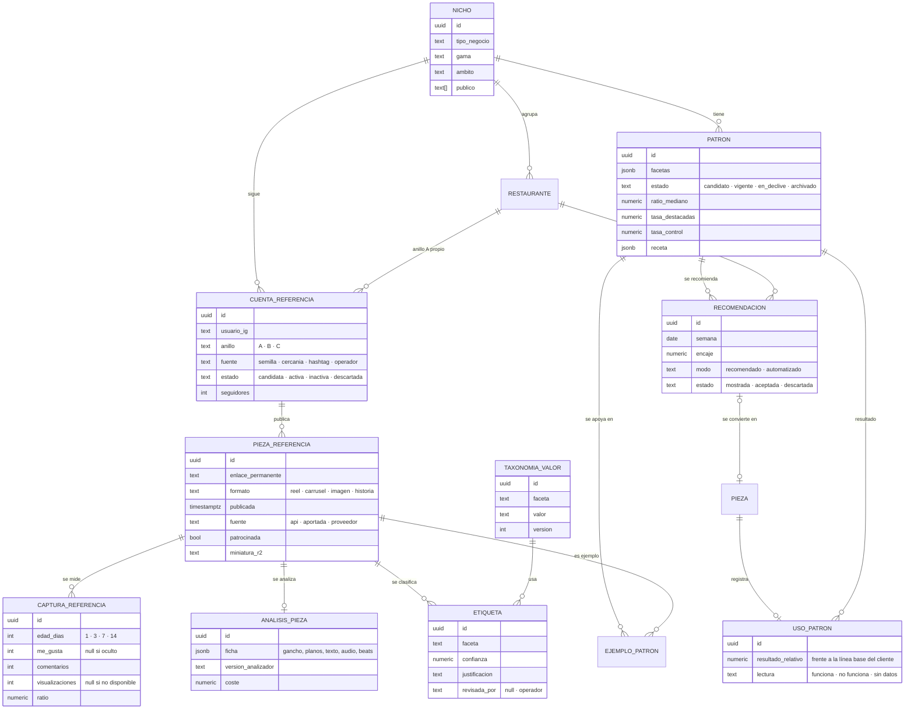

<!-- society-document -->
> **Estado:** vigente · diseño, no implementado. **Fecha de revisión:** 2026-09-25. **Fecha de evidencia:** consultas web del 2026-09-25 (ver §16).
> **Ámbito / a quién obliga:** módulo de Investigación de Society. Cubre la recogida, el análisis y la clasificación de contenido del nicho de cada cliente, y su conversión en recomendaciones y briefs.
> **Fuentes:** §16. Todo lo que dependa de la API de Meta se marca «revalidar», porque este entorno bloquea la documentación de Meta y los datos vienen de resúmenes de búsqueda.
> **Índice único y autoridad:** [README raíz](../README.md).

> **Relación con otros documentos.** Este informe desarrolla el módulo **Investigación** del [sistema operativo de marketing](Society_sistema_operativo_de_marketing.md). Reutiliza:
> - el [analizador de vídeos de referencia](Society_analisis_video_referencia.md) para la ficha plano a plano;
> - el [Ad Recreator](higgsfield/03-ad-recreator-para-society.md) para adaptar una referencia a un brief;
> - el [cerebro estratégico](Society_cerebro_estrategico.md) para puntuar, explorar y aprender.
>
> Sustituye como diseño de producto a la rutina manual de [investigación semanal](../skills/marketing-hosteleria/references/instagram-kb/06-workflows-automatizacion/weekly-content-research.md), que sigue valiendo como procedimiento a mano.

# Society — Radar de nicho

## 1. Qué es y veredicto

El **radar de nicho** responde a la pregunta que se haría una agencia antes de proponer nada a un restaurante: *¿qué está funcionando ahora mismo en negocios como este, y cuáles de esas ideas puede hacer este local con su material real?*

Funciona así:

1. Recoge reels, publicaciones, carruseles y, cuando se puede, historias de las cuentas del nicho del cliente.
2. Las **puntúa respecto a lo normal de cada cuenta**.
3. Analiza cada pieza por dentro.
4. Las **clasifica por formato, función y gancho**.
5. Guarda **las mejores de cada categoría** como *patrones*.
6. Cruza esos patrones con el cliente y produce **recomendaciones**, en modo manual, o **briefs**, en modo automatizado.

**Veredicto: es la pieza que convierte a Society en «criterio de agencia» y no en un generador de imágenes.** También es donde más fácil es equivocarse. Hay tres límites que dan forma a todo el diseño:

| Límite | Consecuencia de diseño |
|---|---|
| **Las historias de otras cuentas no están en ninguna API oficial** y desaparecen a las 24 h | Las historias del nicho solo entran por captura aportada por una persona o como historias destacadas visibles. El radar de historias es **semimanual** (§5.3) |
| **De cuentas ajenas solo se ven métricas públicas**: me gusta y comentarios (y visualizaciones de Reels, sin verificar). No hay alcance, guardados ni compartidos | La puntuación es **relativa a la propia cuenta**, no absoluta (§6). Nunca se promete «el reel con más alcance» |
| **El contenido ajeno no es nuestro**: tiene derechos de autor, personas reconocibles y datos de quien comenta | Se guarda lo mínimo (enlace, métricas, miniatura y análisis). Los vídeos se descargan solo de forma temporal para analizarlos y **nunca se republica ni se copia**: se adapta (§11) |

## 2. Qué entiende Society por «nicho»

El nicho de un cliente se define en el alta con cuatro ejes:

| Eje | Ejemplos | Uso |
|---|---|---|
| **Tipo de negocio y cocina** | Asador, marisquería, bar de tapas, brunch, coctelería, pizzería napolitana | Filtra qué cuentas son comparables |
| **Gama** | Ticket bajo, medio o alto | Un gastrobar no aprende de un estrella Michelin, salvo en formato |
| **Ámbito** | Mismo municipio o radio, región, España, internacional | Define los tres anillos de referencia |
| **Público y momento** | Familias el domingo, afterwork, turismo, celebraciones | Enlaza con las situaciones de consumo del [cerebro §4](Society_cerebro_estrategico.md) |

**Tres anillos de referencia por cliente**

| Anillo | Qué cuentas | Cuántas | Para qué sirve |
|---|---|---|---|
| **A · Competencia local** | Negocios del mismo tipo en el mismo municipio o radio | 5–10 | Saber qué ve ya el público del cliente y no repetir lo mismo |
| **B · Referentes del tipo** | Mismo tipo y gama en España, con buena actividad | 15–30 | Encontrar patrones de contenido que funcionan en ese negocio |
| **C · Referentes de formato** | Cuentas de hostelería de cualquier país con reels que destacan por formato: ritmo, gancho, montaje | 10–20 | Ideas de ejecución, no de negocio |

**Un radar por nicho, compartido.** Dos asadores de la provincia de Málaga comparten los anillos B y C. El radar se calcula **una vez por nicho** y se reparte entre los clientes de ese nicho; el anillo A sigue siendo propio de cada uno. Es lo que hace viable el coste (§12). Lo que se comparte son patrones sobre contenido **público de terceros**; los datos de un cliente nunca pasan a otro (§11).

## 3. Visión general del sistema

```mermaid
flowchart LR
  subgraph DEF["1 · Definir"]
    N["Nicho del cliente<br/>tipo · gama · ámbito · público"]
  end
  subgraph DESC["2 · Descubrir"]
    S["Semillas<br/>propietario · operador"]
    G["Negocios cercanos<br/>misma categoría"]
    H["Hashtags y temas<br/>del nicho"]
    V["Validar cuentas<br/>tipo · actividad · tamaño"]
  end
  subgraph REC["3 · Recoger"]
    R1["Nivel 1 · API oficial<br/>posts y reels públicos"]
    R2["Nivel 2 · aportado<br/>enlaces y capturas de historias"]
    R3["Nivel 3 · proveedor externo<br/>desactivado por defecto"]
  end
  subgraph PUN["4 · Puntuar"]
    P["Rendimiento relativo<br/>frente a la mediana de su cuenta"]
  end
  subgraph ANA["5 · Analizar"]
    A1["Reels<br/>gancho · planos · ritmo · texto · audio"]
    A2["Carruseles y posts<br/>portada · estructura · texto"]
    A3["Historias<br/>secuencia · stickers · CTA"]
  end
  subgraph CAT["6 · Clasificar"]
    C["Formato × función × gancho<br/>× situación × producción"]
  end
  subgraph SEL["7 · Seleccionar"]
    B["Biblioteca de patrones<br/>los mejores de cada categoría"]
  end
  subgraph REC2["8 · Recomendar o automatizar"]
    M["Encaje con el cliente<br/>objetivo · material · capacidad"]
    O1["Modo recomendado<br/>tarjetas «Hazlo para mí»"]
    O2["Modo automatizado<br/>brief al planificador → G1 · G2"]
  end
  subgraph APR["9 · Aprender"]
    L["Pieza del cliente ↔ patrón<br/>resultado → confianza del patrón"]
  end

  N --> S & G & H --> V --> R1 & R2 & R3
  R1 & R2 & R3 --> P --> A1 & A2 & A3 --> C --> B --> M
  M --> O1 & O2
  O1 & O2 --> L
  L -. "ajusta" .-> B
  L -. "ajusta" .-> P
```



La lámina completa, con fuentes, tablas y controles, está en [`diagramas/radar-de-nicho.png`](diagramas/radar-de-nicho.png) (fuente editable: [`.html`](diagramas/radar-de-nicho.html)).

## 4. Descubrir las cuentas del nicho

| Vía | Cómo | Automatizable | Notas |
|---|---|---|---|
| **Semillas del propietario** | En el alta: «¿qué locales te gustan o te hacen competencia?» | No, se pregunta | La vía más fiable para el anillo A |
| **Negocios cercanos de la misma categoría** | Búsqueda en Google Maps o Places por categoría y radio; el nombre se usa para encontrar su Instagram | Parcial | Solo se usa para **descubrir el nombre**. Condiciones de uso de Places por revisar antes de automatizar |
| **Hashtags y temas del nicho** | Hashtags como `#asadormalaga` o `#chuletonmadurado` en la búsqueda oficial de hashtags; las cuentas que aparecen en sus publicaciones destacadas son candidatas | Sí, con límite | Límite: **30 hashtags únicos por cuenta y 7 días** (revalidar) |
| **Cuentas relacionadas y menciones** | Cuentas que se etiquetan o se mencionan entre sí en el anillo B | Parcial | Revisión humana |
| **Curación del operador** | Víctor añade referentes de formato (anillo C) | No | Lista viva por nicho |

**Validación de cada cuenta candidata** (automática, con revisión humana del anillo A):

- es cuenta profesional (empresa o creador), requisito para la API oficial;
- ha publicado en los últimos 30 días;
- tiene al menos 12 piezas en el formato que se va a medir;
- es del tipo de negocio correcto (clasificación por la biografía y la categoría, con confirmación humana);
- **no es un particular**: el radar no sigue cuentas personales ni a creadores pequeños sin actividad comercial (RGPD, §11).

## 5. Recoger las piezas

### 5.1 Tres niveles de fuente

| Nivel | Fuente | Qué da | Estado |
|---|---|---|---|
| **1 · API oficial de Meta** | *Business Discovery* sobre cuentas profesionales: pie de foto, tipo, enlace permanente, fecha, URL del archivo, me gusta, comentarios e hijos de carrusel. Búsqueda de hashtags: publicaciones destacadas y recientes de un hashtag | Posts, carruseles y reels públicos con métricas públicas | **Vía por defecto.** Meta sigue documentando *Business Discovery*, pero una fuente secundaria de 2026 afirma que ya no permite descubrir cuentas arbitrarias. **Revalidar con una llamada real** antes de construir nada encima |
| **2 · Aportado por personas** | Enlaces que pega el propietario u operador; capturas de pantalla de historias; historias destacadas de las cuentas | Historias y cualquier pieza que el nivel 1 no alcance | Siempre disponible. Sin automatización de acceso |
| **3 · Proveedor externo** | Servicios de extracción de datos públicos sin sesión iniciada (Apify y similares) | Más cobertura, incluidas visualizaciones | **Desactivado por defecto.** Solo tras evaluación jurídica documentada (§11) y por nicho, no por cliente |

**Por qué no se construye un scraper propio.** El scraping se hace sin sesión y fuera de las condiciones de Meta. Aunque un tribunal de EE. UU. (*Meta v. Bright Data*, 2024) no lo consideró contrario a esas condiciones, en España rige el RGPD y el criterio de la AEPD: que un dato sea público **no basta** para tratarlo (§11). Un TFG no debe apoyarse en eso.

### 5.2 Calendario de recogida

| Tarea | Frecuencia | Detalle |
|---|---|---|
| Piezas nuevas de las cuentas del radar | Diaria | Solo metadatos y métricas |
| Nuevas capturas de métricas de cada pieza | A 1, 3, 7 y 14 días de su publicación | Para comparar piezas **a la misma edad** |
| Descarga temporal para análisis | Solo candidatas (§6.3) | El archivo se borra al terminar el análisis. Se guardan la ficha y una miniatura |
| Hashtags | Semanal | Dentro del límite de 30 hashtags únicos por 7 días |
| Revisión de cuentas | Mensual | Altas, bajas y cuentas inactivas |

### 5.3 Historias: el caso especial

Las historias son el formato que más pesa en los planes 1 y 2 y el más difícil de observar fuera de la propia cuenta. Se abordan por tres vías, de más a menos fiable:

1. **Historias propias del cliente.** Con acceso a su cuenta, la API da las métricas de sus historias mientras están activas. Es la base real para aprender qué funciona **en este cliente**.
2. **Historias destacadas del nicho.** Son permanentes y muestran lo que cada negocio considera digno de conservar (carta, reseñas, eventos). Se registran por captura aportada.
3. **Captura semanal aportada.** El operador o el propietario hace capturas de historias del anillo A durante la semana y las sube a la bandeja del radar. Society las analiza igual que cualquier otra pieza.

En historias **no hay puntuación de rendimiento** (no hay métricas públicas). Se clasifican por **frecuencia de uso**: qué hace el nicho y cuántas veces. Las recomendaciones de historias se marcan como **«práctica común»**, no como «lo que mejor funciona».

## 6. Puntuar sin engañarse

### 6.1 Por qué no vale ordenar por me gusta

Una cuenta con 80.000 seguidores gana siempre a un bar de barrio con 1.500, y una pieza de hace un mes siempre tiene más que una de ayer. Ordenar por cifras absolutas solo dice quién es grande, no qué contenido funciona.

### 6.2 Rendimiento relativo

Para cada pieza *p* de la cuenta *c* en el formato *f*, capturada a la edad *e* (7 días por defecto):

```text
interacciones(p) = me_gusta(p) + 3 × comentarios(p)             # pesos iniciales, a calibrar
base(c, f, e)    = mediana de interacciones de las últimas 12–30
                   piezas de la cuenta c en el formato f, a la edad e
ratio(p)         = interacciones(p) / base(c, f, e)                # 1,0 = normal para esa cuenta
```

- **Comentarios pesan más** porque cuestan más que un me gusta y el algoritmo los valora más (hipótesis inicial). Los pesos se calibran con las piezas propias de los clientes, donde sí hay guardados y compartidos (§10).
- **Visualizaciones de Reels**: si la fuente las da, se calcula un segundo ratio con ellas y se usa el más conservador de los dos.
- **Cuentas con me gusta ocultos**: la pieza queda **sin puntuar** (ausente ≠ cero). Se analiza igual, pero no puede ser «de las mejores».
- **Piezas patrocinadas o con colaboración pagada**, detectadas por etiqueta de contenido de marca o por el texto: se marcan y se excluyen del ranking, porque su difusión no es orgánica.

### 6.3 Quién pasa a análisis y quién es «de las mejores»

| Umbral | Regla inicial | Por qué |
|---|---|---|
| **Candidata a análisis profundo** | `ratio ≥ 1,5` o top 20 % del nicho en su formato esa semana | Analizar vídeo cuesta. Solo se analiza lo que destaca, más una muestra aleatoria del 5 % como control |
| **Destacada** | `ratio ≥ 2,0` a 7 días y percentil ≥ 90 del nicho en su formato | «El doble de lo normal en su cuenta» es fácil de explicar al cliente |
| **Muestra de control** | 5 % aleatorio de piezas normales | Sin ella no se puede distinguir lo que hacen las mejores de lo que hacen todas |

## 7. Analizar cada pieza

El análisis produce una **ficha estructurada** por pieza. Es la misma idea que el [analizador de vídeos de referencia](Society_analisis_video_referencia.md), ampliada a todos los formatos.

### 7.1 Reels

| Campo | Cómo se obtiene | Herramienta |
|---|---|---|
| Duración, número de planos y ritmo (cortes por segundo) | Detección de cortes | PySceneDetect (analizador) |
| **Gancho (0–3 s)**: qué se ve, qué se lee, qué se oye | Fotogramas del inicio + OCR + transcripción de los primeros segundos | Modelo multimodal sobre fotogramas, PaddleOCR, WhisperX |
| Texto en pantalla: cuánto, cuándo, qué dice | OCR por plano | PaddleOCR |
| Audio: voz, música, sonido ambiente | Transcripción y separación básica | WhisperX, beat_this para el tempo |
| Personas: ¿hay alguien a cámara? ¿manos? ¿clientes? | Detección por plano | Modelo multimodal (sin reconocimiento facial) |
| Producto: cuál, en qué segundo aparece por primera vez | Detección por plano | Modelo multimodal |
| Estructura en beats: gancho → desarrollo → cierre y CTA | Resumen de la ficha | Modelo de lenguaje con salida estructurada |
| Cámara y movimiento | Gramática de plano | Módulos del analizador (fase 2 del [plan de pruebas](../pruebas/analizador-video-referencia/plan-de-pruebas.md)) |

**Herramientas de Higgsfield disponibles.** `video_analysis_create` analiza escena a escena vídeos subidos o de YouTube y avisa de que pierde precisión en vídeos largos. Sirve como **atajo para el piloto** sin montar el analizador propio. `virality_predictor` se reserva para **los borradores propios del cliente** antes de publicar; está limitado a 16 s según la decisión del README §16. No se usa para puntuar referencias ajenas, porque ya tienen métricas reales.

### 7.2 Carruseles y publicaciones de imagen

| Campo | Ejemplos |
|---|---|
| Portada | Foto de plato, titular grande, persona, antes/después, captura de reseña |
| Número de diapositivas y estructura | Lista («5 platos que…»), recorrido por la carta, historia de un producto, preguntas frecuentes |
| Texto por diapositiva | Cuánto y cómo (titular, precio, alérgenos) |
| Estilo visual | Foto real, editorial, plantilla, generado |
| Última diapositiva | CTA (reserva, guardar, enlace en la biografía) o ninguna |

### 7.3 Historias

Secuencia (número de pantallas), tipo de cada una (foto, vídeo, texto, repost), **stickers** (encuesta, pregunta, cuenta atrás, enlace, ubicación), texto y CTA.

### 7.4 Pie de foto (todos los formatos)

Primera línea (gancho), longitud, CTA, número de hashtags (máximo 5 desde diciembre de 2025, README §11), ubicación etiquetada y colaboraciones.

## 8. Clasificar: la taxonomía

Cada pieza recibe **una etiqueta por faceta**. Las facetas son independientes para poder cruzarlas («reels de deseo de producto con gancho de resultado primero»).

| Faceta | Valores iniciales |
|---|---|
| **Formato** | Reel · carrusel · imagen · historia |
| **Función** | Descubrimiento · deseo de producto · oficio y confianza · comunidad y personas · utilidad (horario, carta, cómo llegar) · conversión (reserva, evento, oferta) |
| **Mecanismo de gancho** | Resultado primero (el plato terminado en 0 s) · proceso hipnótico (brasa, corte, emplatado) · pregunta directa · dato o precio en pantalla · persona a cámara · punto de vista del cliente (POV) · antes y después · lista o ranking · humor o tendencia · secreto o detrás de cámaras |
| **Situación de consumo** | Las del [cerebro §4](Society_cerebro_estrategico.md): diario, fin de semana, celebración, afterwork, terraza, grupo… |
| **Producción** | Móvil y sin editar · editado sencillo · producido · persona a cámara · solo producto · con IA visible |
| **Estructura** | Plantilla de beats de §7.1, agrupada en 6–8 estructuras frecuentes |

**Cómo se etiqueta**

- **Automático.** Un modelo de lenguaje recibe la ficha de §7 y devuelve una etiqueta por faceta, con **confianza** y una frase de justificación. La salida sigue un esquema JSON fijo.
- **Revisión humana por muestreo.** El operador revisa el 10 % de las etiquetas cada semana y todas las de confianza baja. Las correcciones quedan registradas y sirven de ejemplos en el siguiente etiquetado.
- **La taxonomía se versiona.** Añadir un valor nuevo («gancho de ASMR de brasa») es un cambio de versión, y las piezas antiguas se reetiquetan solo si se pide.

## 9. Seleccionar: la biblioteca de patrones

Un **patrón** es una combinación de facetas que funciona repetidamente en el nicho. No es una pieza suelta: es «lo que tienen en común varias piezas que destacan».

**Cuándo una combinación se convierte en patrón**

- al menos **3 piezas destacadas** (§6.3)
- de al menos **2 cuentas distintas**
- en los últimos **60 días**
- y su tasa de destacadas es **al menos el doble** que la de la muestra de control con esas mismas facetas.

Si solo hay una pieza o una cuenta, es un **caso aislado**. Se enseña como inspiración, marcado así, pero no alimenta al modo automatizado.

**Ficha de patrón** (lo que ve el operador y, simplificado, el cliente):

```yaml
patron: reel-deseo-resultado-primero-brasa
nicho: asador · gama media · Andalucía
estado: vigente            # candidato · vigente · en declive · archivado
facetas:
  formato: reel
  funcion: deseo de producto
  gancho: resultado primero
  situacion: fin de semana
  produccion: editado sencillo
  estructura: resultado → proceso → servicio en mesa
evidencia:
  piezas_destacadas: 7
  cuentas: 4
  ventana: 2026-07-27 → 2026-09-24
  ratio_mediano: 2,6          # frente a la mediana de cada cuenta
  tasa_destacadas: 21 %       # control con las mismas facetas: 6 %
  ejemplos:                   # solo enlaces, nunca archivos re-alojados
    - https://www.instagram.com/reel/…
por_que_funciona: >
  El plato terminado en el primer segundo resuelve la curiosidad antes del
  scroll; el proceso posterior justifica el precio.   # hipótesis, no causa
receta:
  duracion: 8–14 s
  planos: 5–8
  gancho: plato servido, primer plano, sin texto los 2 primeros segundos
  texto: nombre del plato + precio a partir de 3 s
  audio: sonido ambiente de brasa, sin música con derechos
requisitos_de_material: [plato real fotografiable, brasa o cocina visible]
riesgos: [fatiga si más de 1 por semana, no sirve con local cerrado]
```

**Ciclo de vida.** Un patrón pasa por los estados:

1. **Candidato.**
2. **Vigente**, al cumplir los umbrales.
3. **En declive**, cuando su tasa de destacadas cae a la mitad durante 4 semanas: se nota la fatiga del formato en el nicho.
4. **Archivado.**

Los patrones en declive se siguen enseñando, marcados como tales.

## 10. Recomendar o automatizar para el cliente

### 10.1 Encaje patrón ↔ cliente

Cada semana, para cada cliente, el planificador puntúa los patrones vigentes de su nicho:

| Criterio | Pregunta | Fuente |
|---|---|---|
| **Objetivo** | ¿Sirve al objetivo del periodo? | `/estrategia/objetivo-periodo` |
| **Material** | ¿Tiene el local el material real que exige el patrón? | Inventario de verdad y catálogo |
| **Capacidad** | ¿Puede Society producirlo con la calidad exigida? | Ficha de capacidad de [producción](higgsfield/05-automatizacion-de-produccion.md) |
| **Diferenciación** | ¿Lo hace ya la competencia local del anillo A? | Radar, anillo A |
| **Fatiga** | ¿Lo ha usado el cliente en las últimas 3 semanas? | Registro de piezas |
| **Resultado previo** | ¿Qué pasó las veces que el cliente lo usó? | §10.4 |
| **Coste** | ¿Cabe en el presupuesto del periodo? | Guardián de presupuesto |

**La diferenciación trabaja al revés que el resto.** Un patrón que funciona en el anillo B y **no** usa nadie del anillo A vale más: es una oportunidad para que el cliente destaque en su zona.

### 10.2 Modo recomendado

Es el modo por defecto en los planes 1 y 2 y durante el piloto. El cliente ve en el panel la sección **«Lo que funciona en tu nicho»**:

- 3–5 tarjetas por semana, una por patrón;
- cada una con **2–3 ejemplos** (enlaces que abren Instagram, no copias);
- «por qué funciona» en una frase;
- lo que necesitaría de él («una foto del chuletón servido»);
- un botón **«Hazlo para mí»** que crea el brief.

Víctor u otro operador puede además añadir una nota de criterio profesional.

### 10.3 Modo automatizado

Plan 3, o cuando el cliente lo active:

- los patrones con mejor encaje entran como **candidatos en el paso «Puntuar»** del orquestador;
- el brief resultante cita el `patron_id` y adapta la receta con el [Ad Recreator](higgsfield/03-ad-recreator-para-society.md): diez apartados de análisis y cinco de adaptación;
- **la exploración sigue limitada al 20 %** de los huecos, como fija el [cerebro §4](Society_cerebro_estrategico.md): un patrón nuevo para el cliente cuenta como exploración;
- la pieza pasa por **G1 y G2** como cualquier otra. Automatizado no significa publicar sin firma.

### 10.4 Aprender del cliente

Cada pieza del cliente guarda qué patrón usó. Cuando madura (7 días), su resultado se compara con la línea base **del propio cliente**, y ahí sí hay guardados, compartidos, alcance y visitas al perfil. De esa comparación salen dos aprendizajes:

- **por cliente**: el patrón le funciona, no le funciona o no hay datos suficientes;
- **por nicho**, solo en agregado y si el contrato lo permite (§11): «este patrón ha funcionado en 4 de 6 clientes del nicho». Nunca se comparten cifras ni piezas de un cliente con otro.

Estos datos propios también sirven para **recalibrar los pesos de §6.2**. Si los comentarios predicen los guardados mejor que los me gusta en los clientes, el peso de los comentarios sube.

## 11. Límites legales y éticos

| Tema | Regla del radar | Base |
|---|---|---|
| **Datos personales** | Solo cuentas profesionales de negocios. No se guardan nombres, textos ni perfiles de quien comenta; de los comentarios solo se guarda el **recuento** y, como mucho, temas agregados | RGPD; criterio de la AEPD sobre *scraping*: que un dato sea público no legitima por sí solo tratarlo (README §11) |
| **Scraping** | No hay scraper propio. Un proveedor externo (nivel 3) solo con evaluación de interés legítimo documentada y revisión jurídica | AEPD; condiciones de Meta |
| **Derechos de autor** | Se guardan enlace, métricas, miniatura reducida y ficha de análisis. El vídeo se descarga de forma temporal para analizarlo y **se borra**. Nunca se republica ni se usa como activo | Ley de Propiedad Intelectual |
| **Personas reconocibles** | El análisis dice «persona a cámara», no quién es. Sin reconocimiento facial | RGPD, datos biométricos |
| **Copiar frente a adaptar** | Un patrón describe una estructura, no una pieza. El brief cambia producto, local, personas, texto y audio. No se reutiliza música con derechos | Regla «transformar, no replicar» del [Ad Recreator](higgsfield/03-ad-recreator-para-society.md) |
| **Datos entre clientes** | Los patrones del nicho vienen de contenido público de terceros y se comparten. Los resultados de un cliente solo alimentan el nicho **en agregado** y con cláusula en el contrato | Confidencialidad con el cliente |
| **API de Meta** | Respetar límites de uso y finalidad; no usar la búsqueda de hashtags para contactar con usuarios | Condiciones de la plataforma (revalidar) |

## 12. Volumen y coste orientativo por nicho

Las estimaciones de volumen son de diseño; **no hay precios** porque dependen del proveedor de análisis y deben medirse en el piloto.

| Paso | Volumen semanal por nicho (≈ 50 cuentas) | Coste relativo |
|---|---|---|
| Metadatos y métricas | 100–200 piezas nuevas; 4 capturas por pieza | Casi nulo (llamadas a API) |
| Análisis profundo | ≈ 20 % de candidatas + 5 % de control → 25–50 piezas | **La partida principal**: descarga temporal, transcripción, OCR y modelo multimodal |
| Clasificación | Las mismas 25–50 piezas | Bajo: modelo de lenguaje con salida estructurada |
| Patrones y encaje | Recalcular patrones del nicho; puntuar por cliente | Bajo |
| Revisión humana | 10 % de etiquetas + anillo A | 30–45 min por nicho y semana del operador |

**Por qué compensa el radar compartido.** Con cinco clientes en el mismo nicho, el análisis profundo se paga una vez y se reparte entre cinco. Por eso interesa vender por nichos y zonas: asadores de Málaga, coctelerías de Sevilla…

## 13. Modelo de datos



**Trabajos programados** (pg_cron + worker del orquestador):

| Trabajo | Frecuencia | Qué hace |
|---|---|---|
| `radar_recoger` | Diario | Piezas nuevas y capturas a 1, 3, 7 y 14 días |
| `radar_candidatas` | Diario | Calcula ratios y encola análisis de candidatas y control |
| `radar_analizar` | Continuo (cola) | Descarga temporal → ficha → borrado del archivo |
| `radar_clasificar` | Tras cada análisis | Etiquetas con confianza |
| `radar_patrones` | Semanal (domingo) | Recalcula patrones y estados por nicho |
| `radar_recomendar` | Semanal (lunes, antes del ciclo) | Encaje por cliente → tarjetas o candidatos del planificador |
| `radar_cuentas` | Mensual | Revisión de cuentas del radar |

## 14. Plan de validación y fases

### 14.1 Piloto manual con Torre de Vega

Antes de escribir código se valida el método a mano con el caso práctico:

| Paso | Qué | Resultado verificable |
|---|---|---|
| 1 | Definir el nicho (asador, gama media, Málaga) y reunir 30 cuentas en los tres anillos | Lista con anillo y fuente de cada cuenta |
| 2 | Recoger a mano 4 semanas de piezas (enlace, fecha, me gusta y comentarios a 7 días) en una hoja | ≥ 150 piezas con métricas a la misma edad |
| 3 | Calcular ratios y marcar destacadas | Lista de destacadas por formato |
| 4 | Analizar 30 destacadas y 10 de control (fichas de §7), con el analizador o con `video_analysis_create` de Higgsfield | 40 fichas |
| 5 | Clasificar con la taxonomía; Víctor etiqueta en paralelo 20 piezas sin ver la etiqueta automática | **Acuerdo** entre persona y modelo por faceta |
| 6 | Sacar patrones con las reglas de §9 | 3–6 patrones con evidencia |
| 7 | Producir 2 piezas para Torre de Vega a partir de patrones y medirlas frente a su línea base | Resultado observacional, declarado como tal |

**Criterios para pasar a automatizar**

- acuerdo persona–modelo ≥ 80 % en formato, función y gancho;
- al menos 3 patrones que Víctor considere útiles;
- el coste del análisis por pieza está medido.

### 14.2 Fases hasta enero de 2027

| Fase | Contenido | Depende de |
|---|---|---|
| **R0 · Piloto manual** | §14.1, en hoja de cálculo | Nada |
| **R1 · Recogida** | Tablas de §13, nivel 1 (tras revalidar la API) y nivel 2 con bandeja de subida | Acceso a la API de Meta |
| **R2 · Puntuación** | Ratios, candidatas y control | R1 |
| **R3 · Análisis y clasificación** | Ficha por formato; taxonomía versionada; revisión por muestreo | R2, analizador (fases 0–1 del plan de pruebas) |
| **R4 · Patrones y modo recomendado** | Biblioteca de patrones; tarjetas «Lo que funciona en tu nicho» | R3 |
| **R5 · Modo automatizado y aprendizaje** | Candidatos en «Puntuar»; `uso_patron`; recalibrado de pesos | R4, planificador |

## 15. Decisiones abiertas

| Decisión | Opciones | Condición de cierre |
|---|---|---|
| ¿Sigue disponible *Business Discovery* y qué campos da (¿visualizaciones de Reels?) | Sí / no / parcial | Una llamada real con la cuenta propia de Society |
| Proveedor de nivel 3 | Ninguno / uno con evaluación jurídica | Evaluación de interés legítimo firmada y beneficio claro frente al nivel 1 |
| Pesos de interacción | `1 · 3` inicial | Calibrar con datos propios de 3 clientes o de la cuenta de Society |
| Umbrales de destacada y de patrón | Los de §6.3 y §9 | Piloto R0: que salgan 3–6 patrones útiles por nicho |
| Analizador | Propio (plan de pruebas) / Higgsfield `video_analysis` / mixto | Coste y precisión en las 40 fichas del piloto |
| Aprendizaje entre clientes | Solo por cliente / agregado por nicho | Cláusula contractual y ≥ 3 clientes en el nicho |
| ¿El cliente ve las cuentas de su competencia? | Sí, con enlaces / solo patrones | Criterio comercial: ver al competidor puede generar rechazo |

## 16. Fuentes

Consultas del 2026-09-25. La documentación de Meta está bloqueada en este entorno; los datos de Meta vienen de resúmenes de búsqueda y hay que **revalidarlos** en la fuente antes de implementar.

- **Meta for Developers — IG User Business Discovery:** <https://developers.facebook.com/documentation/instagram-platform/instagram-graph-api/reference/ig-user/business_discovery>, y **Business Discovery (API con inicio de sesión de Facebook):** <https://developers.facebook.com/documentation/instagram-platform/instagram-api-with-facebook-login/business-discovery>. Contenido: datos públicos de otras cuentas profesionales, con campos de medios que incluyen `like_count`, `comments_count`, `media_type`, `media_url`, `permalink`, `timestamp` y `caption`.
- **Fuente secundaria discrepante:** Elfsight, *Instagram Graph API: Complete Developer Guide for 2026*, <https://elfsight.com/blog/instagram-graph-api-complete-developer-guide-for-2026/>. Afirma que en 2026 no hay descubrimiento de cuentas arbitrarias. Es el motivo del «revalidar».
- **Límites de la búsqueda de hashtags** (30 hashtags únicos por 7 días; recientes de las últimas 24 h; historias no incluidas): Curator, <https://help.curator.io/article/197-instagram-hashtag-source-limitation>; Emplifi, <https://docs.emplifi.io/platform/latest/home/instagram-hashtag-limitation-faq>.
- **Meta Ad Library** (solo anuncios; en la UE, todos los anuncios con alcance estimado): <https://transparency.meta.com/researchtools/ad-library-tools>. No se usa en el lanzamiento porque los locales pequeños apenas anuncian; queda como fuente futura para el anillo B.
- **AEPD — Herramientas de data scraping para la evaluación de tendencias:** <https://www.aepd.es/informes-y-resoluciones/criterios-juridicos-aepd/herramientas-data-scraping-para-evaluacion-de-tendencias>.
- **Meta v. Bright Data (EE. UU., enero de 2024):** resumen de Quinn Emanuel, <https://www.quinnemanuel.com/the-firm/news-events/client-alert-meta-v-bright-data-significant-decision-for-web-scraping-industry/>. Marco jurídico distinto del español; no legitima el tratamiento bajo el RGPD.
- **Herramientas de Higgsfield conectadas en la sesión:** `video_analysis_create` (análisis escena a escena de vídeo subido o de YouTube) y `virality_predictor` (predicción de rendimiento de un vídeo propio). Descripciones leídas el 2026-09-25; sin ejecutar.
- **Internos:** [sistema operativo de marketing](Society_sistema_operativo_de_marketing.md), [analizador de vídeos de referencia](Society_analisis_video_referencia.md) y su [plan de pruebas](../pruebas/analizador-video-referencia/plan-de-pruebas.md), [Ad Recreator](higgsfield/03-ad-recreator-para-society.md), [cerebro estratégico](Society_cerebro_estrategico.md), [scrapers](../skills/marketing-hosteleria/references/instagram-kb/05-herramientas/scrapers.md), [investigación semanal](../skills/marketing-hosteleria/references/instagram-kb/06-workflows-automatizacion/weekly-content-research.md).
