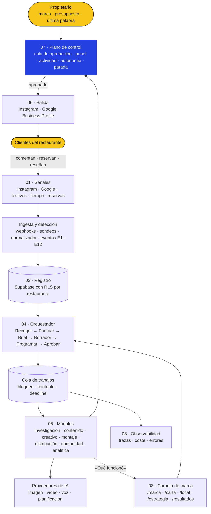
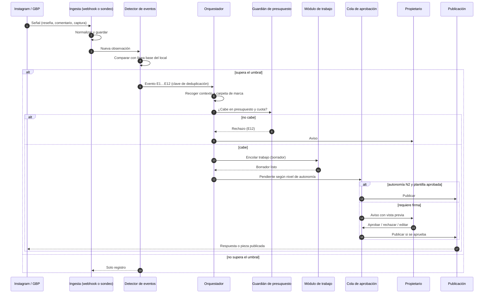
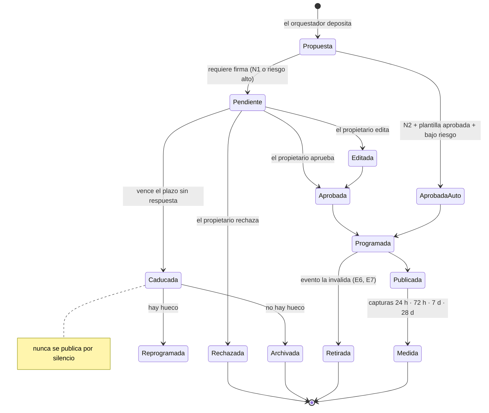
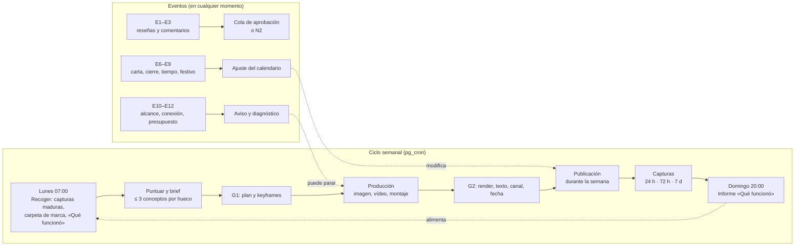
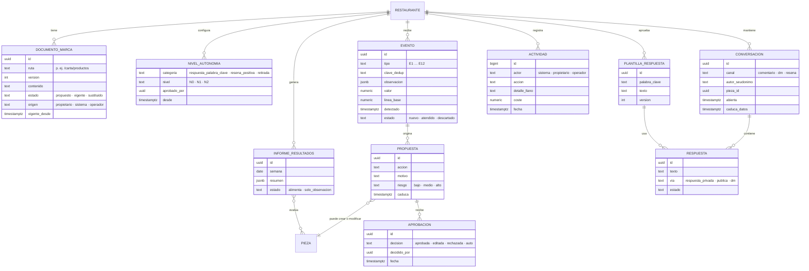

<!-- society-document -->
> **Estado:** vigente · diseño, no implementado. **Fecha de revisión:** 2026-09-25. **Fecha de evidencia:** vídeo analizado el 2026-09-25; consultas web del 2026-09-25.
> **Ámbito / a quién obliga:** arquitectura del producto Society (capas de eventos, interacción, control y observabilidad) y operación de marketing de la cuenta propia de Society.
> **Fuentes:** vídeo «The One-Person Marketing Team» (Structure Webworks), analizado fotograma a fotograma; informes vigentes de Society enlazados en el cuerpo; fuentes externas en §15. Lo no verificado se marca como tal.
> **Índice único y autoridad:** [README raíz](../README.md).

> **Prevalencia.** Este informe **no sustituye** a ninguno vigente. Producción, costes y puertas G0/G1/G2 siguen rigiéndose por [producción §4](higgsfield/05-automatizacion-de-produccion.md); la planificación y el aprendizaje, por el [cerebro estratégico](Society_cerebro_estrategico.md); el flujo de alta y publicación, por el [flujo de la aplicación](Society_flujo_de_la_aplicacion.md). Este documento añade las capas que faltaban y las conecta con las existentes.

# Society — Sistema operativo de marketing

## 1. Veredicto

**Sí: un sistema así es muy útil para Society, y encaja casi exactamente con lo que Society quiere ser.** El vídeo enseña a una persona que opera todo el marketing de un negocio con un bucle automatizado:

1. señales;
2. registro;
3. cerebro;
4. departamentos;
5. publicación;
6. interacción;
7. analítica;
8. vuelta a las señales.

Society es ese mismo bucle **convertido en producto y repetido para cada restaurante**.

La mitad del sistema ya está diseñada en los informes vigentes: planificador, producción con contrato de plano, puertas humanas y medición. El vídeo aporta **seis piezas** que en Society faltaban o estaban dispersas:

| # | Pieza que aporta el vídeo | Estado en Society antes de este informe | Qué se decide aquí |
|---|---|---|---|
| 1 | **Capa de interrupciones**: eventos que rompen el ciclo semanal y se atienden sin esperar al lunes | Solo el ciclo semanal programado | Catálogo de 12 eventos de hostelería con detección, acción y puerta (§7) |
| 2 | **Plano de control**: panel del propietario, cola de aprobación, registro de actividad, permisos, alertas e interruptor de parada | Puertas G0/G1/G2 y avisos sueltos | Plano de control único y niveles de autonomía por restaurante (§8) |
| 3 | **Capa de interacción** (*Engage*): respuestas a comentarios y DMs, y reseñas | Mencionada en herramientas, sin diseño | Módulo «Comunidad y reseñas» con plantillas aprobadas (§6.6) |
| 4 | **Capa de conocimiento** como sistema de archivos de marca | Reglas versionadas en base de datos | «Carpeta de marca» por restaurante, versionada y legible por el propietario (§6.3) |
| 5 | **Datos y observabilidad** | Capturas de métricas | Registro de eventos, trazas por trabajo y errores (§6.9) |
| 6 | **Cierre explícito del bucle**: «qué convirtió esta semana» alimenta la investigación | Descrito en el cerebro estratégico | Informe «Qué funcionó» como entrada formal del planificador (§6.8) |

Además, el sistema tiene **dos usos**:

- **A · Dentro del producto.** Una instancia del bucle por restaurante, multi-cliente, sobre el stack ya decidido (Supabase, Vercel, workers, R2). Es el uso principal.
- **B · Operación interna de Society.** La cuenta propia de Society (README §4.1) la lleva una sola persona, Víctor, y puede operarse con un bucle ligero muy parecido al del vídeo mientras no hay producto (§11). Esto es operación de marketing, no código de la aplicación, así que respeta la filosofía del TFG.

## 2. Qué muestra el vídeo

**Ficha.** Vídeo vertical de 112 s (720 × 1280, 30 fps). Firma: *Structure Webworks*. Formato de *reel* con narrador a cámara, un diagrama general y animaciones paso a paso. El audio no se ha podido transcribir porque el entorno bloquea la descarga de modelos de voz. La narración se ha reconstruido con los **subtítulos incrustados**, extrayendo la franja de subtítulos cada 0,4 s, y con los textos del diagrama.

### 2.1 Narración (reconstruida de los subtítulos)

| Tiempo | Texto en pantalla | Qué se ve |
|---|---|---|
| 0–6 s | «So this is the secret to building a one person company that feels like 23 employees working for you» | Diagrama completo «The One-Person Marketing Team» |
| 6–10 s | «36 agents and they run your entire marketing» | Zoom a los seis departamentos |
| 10–14 s | «The research, the content, the posting, the email, the numbers» | Recorrido por cada departamento |
| 14–17 s | «Because marketing isn't a funnel, it's a loop» | Narrador |
| 17–28 s | — | Animación: seis departamentos conectados y el bloque «One loop, live · compounds every week» |
| 28–31 s | «A whole marketing team used to sit in the middle of that. Let me show you» | Narrador |
| 31–50 s | «first: Research and content» | Google Trends, Semrush y SparkToro alimentan a «The Brain»; terminal `claude research --sync` («3 sources synthesized»); «Claude writes → Surfer ranks it»; tarjeta *Post Draft* (SEO 86, lectura 48 s, alcance estimado 9,4 K) con **Approve / Not approve**: «the final yes is still yours» |
| 50–51 s | — | *Published* en Instagram, YouTube, TikTok, Facebook y LinkedIn («Live on 5 channels») |
| 51–62 s | «Then creative and distribution. The visible part» | Canva + Midjourney → gráfico → «Remotion renders» → «ElevenLabs voice» → «Short, ready» |
| 62–68 s | — | Metricool publica en Facebook, Instagram, TikTok, LinkedIn y YouTube (terminal `metricool publish --queue`) |
| 68–72 s | — | «ManyChat auto-replies»: un comentario pregunta por disponibilidad y la marca responde con un *AUTO-REPLY* y un enlace |
| 72–75 s | «Nobody logs in» | Narrador |
| 75–95 s | «Moving to analytics» | HubSpot (*Calls booked*) + Klaviyo (*Emails opened*) → Looker Studio (41 llamadas, 3.208 aperturas, 6,2 % de conversión) → búsqueda «what content converted this week» → tarjeta **What worked** · *Feeding research* (4 posts planificados, mejor: Post #2, próxima semana: +2 casos de éxito) |
| 95–109 s | «So one layer sits on top: Claude Code» | Claude Code conectado a CRM, calendario, 6 canales y analítica; lee **archivos de texto plano** (`./brand/voice.md`, `offer.md`, `rules.md`) y orquesta Calendar, CRM, Metricool, Instagram, Klaviyo y Looker. Encima, **«You · brand & budget, final say»** |
| 109–112 s | «Want the full system? Comment Marketing and I'll send it over» | Llamada a comentar una palabra clave |

**Nota.** El cierre del vídeo es a su vez una demostración de su capa de interacción: la palabra clave en comentarios dispara un DM automático con el recurso. Es un captador de contactos.

### 2.2 El diagrama general, bloque a bloque

Transcrito de los fotogramas a resolución completa (0–15 s):

| Bloque | Subtítulo en el diagrama | Herramientas que aparecen | Función |
|---|---|---|---|
| **01 · Signals** | «where every market & brand signal comes from» | Datos de búsqueda, analítica web, rankings de competencia (Semrush), interés de búsqueda (Trends), métricas de FB e IG, investigación de audiencia (SparkToro), analítica de canal (YouTube), menciones | Todo lo que entra desde fuera |
| **02 · System of record** | «the brand spine, one unified profile» | CRM y contactos (HubSpot), calendario de contenidos (Airtable), archivo de activos (Drive), wiki de manual (Notion), CDP (Segment), almacén unificado (Supabase), lista de audiencia (Kit) | La «columna vertebral»: un perfil único de la marca |
| **Owner input** | «what the one human sets» · **HUMAN-LED · NOT COUNTED** | Voz de marca, techo de presupuesto, listón de aprobación, posicionamiento y oferta | Lo único que decide la persona |
| **03 · The brain** | «the labour» | Razonamiento (Claude), ejecutor de agentes (LangGraph), memoria (pgvector), visuales (Midjourney), voz (ElevenLabs), investigación en vivo | «Claude razona y escribe, LangGraph ejecuta agentes de varios pasos, pgvector recuerda cada tema y prueba, Midjourney y ElevenLabs producen imagen y voz» |
| **03 · Orchestrator** | «every event enters here first · nothing publishes on its own» | Canal: **Collects → Scores → Briefs → Drafts → Schedules → Approves**. Claude AI + LangGraph «reasons against the playbook, remembers with pgvector» | «Routine content ships end to end. Only budget changes and edge cases reach the owner.» |
| **04 · Knowledge layer + access** | «the brand brain · one shared workspace» | *Marketing OS file system* en carpetas `/brand`, `/research`, `/content`, `/creative`, `/distribution`, `/audience` y `/analytics`, con archivos `.md` (voice-guide, positioning, trend-map, content-calendar, hook-bank, channel-playbooks, kpi-model, attribution…). Plano de control: **panel del propietario, cola de aprobación, registro de actividad, permisos, alertas e interruptor de parada** | Conocimiento compartido y control |
| **05 · Departments** | «six departments an owner recognizes» | **Research & Intelligence** (audiencia, rankings de competencia, tendencias, backlinks, síntesis de señal) · **Content Engine** (textos, puntuación on-page, briefs, edición, variaciones) · **Creative Studio** (gráficos Canva, imágenes IA, vídeo por código, maquetas Figma, voz) · **Distribution & Publishing** (programador Metricool, cola, publicación masiva, automatización de X, respuestas a DMs con ManyChat) · **Audience & Email** (Kit, newsletter, automatización, landings, captación) · **Analytics & Optimization** (tráfico y conversión, paneles Looker, analítica con privacidad, consultas *ad hoc*, informes y aprendizaje) | La plantilla de «23 empleados» |
| **06 · Engage** | «approved content goes back out from one brain» | Programar posts sociales, enviar email, publicar en varios canales, respuestas a DMs → **Audience** | Salida y conversación |
| **07 · Data & observability** | «the numbers behind every card on the report» | Airbyte (ETL), dbt (transformación), BigQuery (almacén), Looker BI, analítica web, informes de cohortes, Sentry (errores) | «Airbyte lleva Search Console, GA4 y datos sociales a BigQuery, dbt los modela, Looker Studio sirve el informe, Metabase cruza cohortes y Sentry vigila el stack» |
| **What interrupts the loop** | «eight things that used to need a marketer at a desk, and who handles them now» | Pico de demanda de búsqueda · el competidor baja precios o lanza algo · calendario flojo · un ranking cae · un post se hace viral · fatiga del creativo de anuncios · avalancha de comentarios o DMs · caen las aperturas de email | Eventos que se atienden fuera del ciclo |

Las líneas del diagrama distinguen tres tipos de flujo:

- **negras**, flujo de trabajo principal;
- **azules discontinuas**, lectura y escritura de la capa de conocimiento;
- **rojas y moradas**, retorno de resultados y señales al principio del bucle.

### 2.3 Qué hay de sustancia y qué es promoción

| Afirmación del vídeo | Lectura |
|---|---|
| «23 empleados», «36 agentes» | **No verificado.** Es una cifra de impacto, no una arquitectura medida. Cuenta herramientas y funciones como «empleados» |
| Métricas de la demo (SEO 86, 9,4 K, 41 llamadas, 6,2 %) | **Ilustrativas**, sin fuente ni periodo. No sirven como referencia de resultados |
| «Nothing publishes on its own» y a la vez «routine content ships end to end» | Hay una **tensión**: lo rutinario se publica sin revisión y solo lo excepcional llega a la persona. Society ya decidió lo contrario por defecto: **nunca publicar por silencio**. Ver §8 |
| «Marketing isn't a funnel, it's a loop» | **Idea sólida** y coherente con el [cerebro estratégico](Society_cerebro_estrategico.md) |
| Conocimiento en archivos de texto (`voice.md`, `offer.md`, `rules.md`) que lee el orquestador | **Idea sólida.** Es barata, auditable y legible por una persona |
| El stack concreto (unas 25 herramientas SaaS) | Pensado para **un único negocio B2B de contenido SEO y email**, no para un producto multi-cliente de hostelería. Ver §10 |
| «Comment Marketing» | Captación de contactos con palabra clave → DM. El propio vídeo es un ejemplo de la capa de interacción |

## 3. Por qué encaja con Society

El vídeo resuelve el problema de **una persona con un negocio**. Society resuelve el de **muchos negocios sin persona de marketing**. La forma del sistema es la misma. Cambian cuatro cosas:

1. **Multi-cliente.** Cada capa se instancia por restaurante, con datos aislados (RLS en Supabase), presupuesto propio y conocimiento propio. Una suscripción SaaS por restaurante y herramienta (ManyChat, Metricool, HubSpot…) haría inviable el margen de los planes 1 y 2.
2. **Hostelería, no B2B.** La conversión no son «llamadas reservadas» ni «aperturas de email». Son **reservas, llamadas al local, rutas a Google Maps, DMs de consulta y reseñas**. El email apenas pesa; pesan Google Business Profile, Instagram y, a veces, WhatsApp.
3. **Material real.** El vídeo genera contenido desde cero. Society parte del local real y de un [contrato de plano](Society_diseno_y_viabilidad.md) con activos verificados.
4. **Puertas humanas por defecto.** El propietario de un bar no quiere revisar 40 cosas por semana, pero tampoco quiere que se publique algo falso en su nombre. De ahí los **niveles de autonomía** del §8.

## 4. Correspondencia entre el vídeo y Society

| Bloque del vídeo | Equivalente en Society | Documento que ya lo cubre | Hueco que cubre este informe |
|---|---|---|---|
| 01 · Signals | Métricas de Instagram y GBP, reseñas, calendario de festivos, competencia agregada, parte meteorológico (nuevo) | [Cerebro §3](Society_cerebro_estrategico.md) | Conectores con normalización y detección de eventos (§6.1, §7) |
| 02 · System of record | Supabase: Restaurante, Producto, Recurso, Pieza, Captura de métricas… | [README §8.1](../README.md) | Registro de eventos y de actividad (§12) |
| Owner input | Alta, G0, reglas del restaurante, techo de presupuesto | [Flujo §4](Society_flujo_de_la_aplicacion.md) | Nivel de autonomía por categoría (§8) |
| 03 · The brain | Planificador (propuesta vigente: GPT-6 Astra) + generadores de imagen, vídeo y voz | [README §9](../README.md), [Cerebro](Society_cerebro_estrategico.md) | Sin cambios de proveedor. El diseño es independiente del modelo |
| 03 · Orchestrator | Cola de trabajos en PostgreSQL + worker orquestador | [Producción §4](higgsfield/05-automatizacion-de-produccion.md) | Canal único **Recoger → Puntuar → Brief → Borrador → Programar → Aprobar** para ciclos y eventos (§6.4) |
| 04 · Knowledge layer | Reglas versionadas, biblia visual, fichas de personaje | [Patrón documental](2026-09-22_patron-documental.md), [Flujo §5.3](Society_flujo_de_la_aplicacion.md) | **Carpeta de marca** por restaurante (§6.3) |
| 04 · Access / control plane | Puertas G0/G1/G2, avisos por Resend | [Flujo §7](Society_flujo_de_la_aplicacion.md) | **Plano de control** completo (§8) |
| 05 · Departments | Módulos de producción y estrategia | [Estrategia §10.1](Society_estrategia_redes_y_retroalimentacion.md) | Seis módulos con nombre reconocible para el hostelero (§6.5) |
| 06 · Engage | Publicación por API o asistida | [Flujo §5.9](Society_flujo_de_la_aplicacion.md) | **Comunidad y reseñas**: comentarios, DMs y respuestas a reseñas (§6.6) |
| 07 · Data & observability | Capturas 24 h, 72 h, 7 y 28 días | [Estrategia §5](Society_estrategia_redes_y_retroalimentacion.md) | Trazas, errores y coste por trabajo (§6.9) |
| What interrupts the loop | — | — | **Catálogo de eventos** (§7) |
| «What worked · feeding research» | Registro de aprendizaje | [Cerebro §5](Society_cerebro_estrategico.md) | Informe semanal «Qué funcionó» como entrada formal (§6.8) |

## 5. Diagrama técnico completo

Arquitectura del sistema operativo de marketing de Society. Todo lo que aparece dentro de «Society» es multi-cliente y está aislado por restaurante. Los proveedores externos se llaman desde workers, nunca desde el navegador.



La lámina completa, con cada componente y cada flujo, está en [`diagramas/sistema-operativo-marketing.png`](diagramas/sistema-operativo-marketing.png) (fuente editable: [`.html`](diagramas/sistema-operativo-marketing.html)).

**Cómo leerlo**

- Todo evento, sea programado (ciclo semanal) o reactivo (señal que supera un umbral), entra por **Recoger** en el orquestador. Nada llega a publicarse sin pasar por el canal completo, igual que en el vídeo («every event enters here first»).
- El orquestador **no llama a proveedores directamente**: encola trabajos. Los módulos los ejecutan con bloqueo, reintento y *deadline*, como ya fija [producción §4](higgsfield/05-automatizacion-de-produccion.md).
- **Aprobar** no es un paso del modelo: deposita la pieza en la **cola de aprobación** del plano de control. Lo que sale sin firma humana depende del nivel de autonomía (§8).
- El informe **«Qué funcionó»** cierra el bucle: alimenta las memorias y el panel, y de ahí la siguiente planificación.

## 6. Capas en detalle

### 6.1 Señales e ingesta

| Fuente | Cómo entra | Frecuencia | Qué se guarda | Notas |
|---|---|---|---|---|
| Instagram: comentarios y DMs | Webhook de Meta → Edge Function | Tiempo real | Conversación, autor seudonimizado, texto, pieza | Requiere App Review para cuentas de clientes (README §9) |
| Instagram: *insights* de pieza y cuenta | Sondeo con `pg_cron` | 24 h, 72 h, 7 y 28 días por pieza; diario por cuenta | Captura de métricas con definición y unidad | Ausente ≠ cero ([estrategia §5.2](Society_estrategia_redes_y_retroalimentacion.md)) |
| Google Business Profile: reseñas | Sondeo | Cada 1–3 h | Reseña, nota, texto, estado de respuesta | Requiere solicitud de acceso a la API |
| Google Business Profile: métricas | Sondeo | Diario | Búsquedas, rutas, llamadas, clics a web | — |
| Calendario oficial | Sondeo | Semanal | Festivos por municipio y eventos locales | Un festivo no implica que el local abra ([cerebro §3](Society_cerebro_estrategico.md)) |
| Parte meteorológico | Sondeo | 2 veces al día | Previsión de 3 días en el municipio | **Nuevo.** Solo para locales con terraza o platos de temporada. Proveedor por decidir |
| Competencia | Sondeo | Semanal | Resumen agregado con fuente y fecha | Sin *scraping* ni datos personales (README §11) |
| Reservas y conversiones | Webhook o registro manual | Tiempo real o diario | Evento de conversión con canal y código de campaña | Solo si el local usa un sistema que lo permita |

El **normalizador** convierte todo a un formato común: restaurante, fuente, métrica, valor, unidad, ventana, fecha de captura y definición. El **detector de eventos** compara contra la línea base de cada restaurante (§7).

### 6.2 Registro

Sigue en Supabase (PostgreSQL + Auth), con RLS por restaurante. Este informe solo añade las tablas del §12:

- `evento` y `actividad`, de solo inserción;
- `conversacion` y `respuesta`;
- `plantilla_respuesta`;
- `nivel_autonomia`;
- `informe_resultados`.

### 6.3 Conocimiento: la carpeta de marca

Idea tomada del *Marketing OS file system* del vídeo, adaptada al restaurante. Cada restaurante tiene una **carpeta de marca**: un conjunto de documentos cortos y versionados que el planificador lee antes de decidir y que el propietario puede leer y corregir en lenguaje llano.

```text
/marca
  voz.md                  tono, tuteo o usted, palabras prohibidas
  identidad.md            colores, tipografías, estilo de foto, logotipo
  personajes.md           fichas aprobadas de personas que aparecen
  prohibiciones.md        lo que nunca se publica
/carta
  productos.md            platos confirmados, precio, alérgenos, disponibilidad
  novedades.md            fecha de inicio y fin
/local
  datos.md                horarios, aforo, terraza, canal de reserva
  espacios.md             inventario de verdad del local
/estrategia
  objetivo-periodo.md     objetivo primario, restricción, condición de parada
  pilares.md              situaciones de consumo y pilares
  hipotesis.md            hipótesis abiertas
/canales
  instagram.md            frecuencia, formatos, horarios, hashtags (máx. 5)
  google.md               publicaciones, respuestas a reseñas
/comunidad
  respuestas.md           plantillas aprobadas de respuesta a comentarios y DMs
  resenas.md              criterios de respuesta a reseñas
/resultados
  que-funciono.md         último informe semanal (lo escribe el sistema)
  aprendizajes.md         aprendizajes confirmados con su confianza
```

**Decisiones de diseño**

- **Se guarda en la base de datos, no en ficheros sueltos.** Cada documento es una fila con versión, autor, fecha y estado: propuesto, vigente o sustituido. El formato de «carpeta» es la **vista** que ve el propietario y el **contexto** que recibe el planificador, igual que el `./brand/voice.md` del vídeo.
- **El sistema propone y el propietario confirma.** Un cambio que venga de fuera (una reseña, un comentario, la competencia) nunca modifica la carpeta directamente. Crea una propuesta que pasa por la cola de aprobación. Así lo exige ya el [cerebro estratégico §3](Society_cerebro_estrategico.md): un comentario público no cambia reglas.
- **Los hechos se resuelven por versión y fecha. La búsqueda semántica solo recupera referencias.** Es lo que el vídeo hace con pgvector, con el límite que ya fija el cerebro estratégico.
- **`/resultados` lo escribe el sistema.** El resto lo confirma una persona.

### 6.4 Orquestador

Un único canal para el ciclo semanal y para los eventos:

| Paso | Qué hace | Entrada | Salida | ¿Llama a un modelo? |
|---|---|---|---|---|
| **Recoger** | Reúne el disparador (ciclo o evento), el estado del restaurante y la carpeta de marca | Evento o tick semanal | Contexto del ciclo | No |
| **Puntuar** | Prioriza oportunidades: objetivo → urgencia → evidencia → formato → fatiga → coste ([cerebro §4](Society_cerebro_estrategico.md)) | Contexto | Lista ordenada con motivo | Sí, con salida estructurada |
| **Brief** | Escribe el brief de pieza con su justificación trazable | Oportunidad elegida | Brief | Sí |
| **Borrador** | Encola los trabajos de producción (texto, imagen, vídeo, montaje) | Brief | Trabajos en cola | Solo el módulo de contenido |
| **Programar** | Asigna canal, fecha y hora. Comprueba presupuesto, cuotas y conflictos de calendario | Pieza producida | Pieza programada provisional | No |
| **Aprobar** | Deposita en la cola de aprobación según el nivel de autonomía | Pieza programada | Pendiente, aprobada o rechazada | No |

**Reglas del orquestador**

- **Idempotencia.** Un mismo evento no produce dos piezas. La clave de deduplicación es restaurante + tipo de evento + objeto + ventana.
- **Presupuesto antes de generar.** El guardián de presupuesto rechaza el trabajo si supera el techo del periodo (README §16: «presupuesto antes de generar»).
- **Interruptor de parada.** Si está activo, el orquestador no encola nada nuevo. Los trabajos en curso terminan pero no se publican.
- **Silencio del propietario.** Si una pieza caduca sin aprobación, se reprograma o se archiva. **Nunca se publica por silencio** ([flujo §7](Society_flujo_de_la_aplicacion.md)).

### 6.5 Módulos de trabajo

Los seis departamentos del vídeo, traducidos a lo que un hostelero reconoce. Los módulos reutilizan el stack ya decidido.

| Módulo | Equivale en el vídeo a | Hace | Tecnología (README §9) |
|---|---|---|---|
| **Investigación** | Research & Intelligence | Tendencias locales, festivos, competencia agregada, síntesis de señales | Modelo de planificación + fuentes públicas |
| **Contenido** | Content Engine | Captions, hooks, guiones y variantes; comprueba reglas de marca, hashtags y alérgenos | Modelo de planificación |
| **Estudio creativo** | Creative Studio | Imágenes desde fotos reales, vídeo por contrato de plano, voz | Nano Banana Pro, Kling 3.0 / Seedance 2.5, ElevenLabs |
| **Montaje** | Creative Studio (vídeo por código) | Plantillas, rótulos, subtítulos y render | Remotion en worker Linux |
| **Distribución** | Distribution & Publishing | Publicar en Instagram y Google, o dejar lista la publicación asistida | Instagram API, GBP API |
| **Comunidad y reseñas** | Audience & Email + Engage | Respuestas a comentarios, DMs y reseñas con plantillas aprobadas | Instagram Messaging API, GBP API |
| **Analítica** | Analytics & Optimization | Capturas, líneas base, informe «Qué funcionó» | PostgreSQL + panel propio |

**Qué se sustituye respecto al vídeo:**

- **El email.** Audience & Email se sustituye por **Comunidad y reseñas**. En hostelería el canal de conversación es el comentario, el DM y la reseña.
- **SEO y blog.** Search Console, Surfer y backlinks se sustituyen por **Google Business Profile**, que es el SEO local que importa a un bar (plan 1).

### 6.6 Comunidad y reseñas (capa de interacción)

Es la capa que más valor añade sobre lo ya diseñado, y la que el vídeo resuelve con ManyChat.

**Comentarios con palabra clave → respuesta privada.** Meta permite enviar una **respuesta privada** a quien comenta en un post o Reel de una cuenta profesional: **un mensaje, dentro de los 7 días** siguientes al comentario. El límite es de 750 respuestas privadas por hora y cuenta. Consulta del 2026-09-25; revalidar antes de implementar ([fuente](https://developers.facebook.com/documentation/instagram-platform/private-replies)). Casos de uso en hostelería:

| El cliente comenta | Respuesta privada (plantilla aprobada) | Objetivo |
|---|---|---|
| «CARTA» | Enlace a la carta vigente | Consulta cualificada |
| «RESERVA» | Canal de reserva del local | Reserva atribuible por código de campaña |
| «HORARIO» | Horario vigente, incluidos los especiales | Evitar visitas en vano |
| Pregunta libre sobre un plato | Respuesta generada desde `/carta`, **pendiente de aprobación** | Solo con datos confirmados |

**Reseñas de Google**

- **Positivas.** Borrador con la voz de la marca. Se publica sola solo en nivel N2 (§8) y solo si la reseña no menciona incidencias.
- **Negativas o con incidencias.** Borrador, **siempre con aprobación** y aviso inmediato al propietario.
- **Nunca** se generan, filtran ni condicionan reseñas (README §11, Real Decreto-ley 24/2021).

**Límites que se mantienen**

- Las respuestas no inventan datos: precio, disponibilidad y alérgenos solo salen de `/carta` vigente.
- Si el cliente pide algo fuera de plantilla, queja o reserva compleja, la conversación pasa al propietario.
- Datos personales mínimos: se guarda un identificador seudonimizado y el texto necesario, con caducidad (RGPD).

### 6.7 Distribución

Sin cambios respecto al [flujo §5.9](Society_flujo_de_la_aplicacion.md): publicación por API cuando haya acceso verificado y **ruta asistida** mientras tanto. Este informe solo añade dos cosas:

- **Cola de reserva.** Piezas atemporales ya aprobadas que el orquestador usa cuando el calendario se queda flojo (§7, evento E4).
- **Bloqueo por evento.** Una pieza programada se retira si un evento la invalida: plato agotado, cierre o cambio de horario.

### 6.8 Analítica y cierre del bucle

El informe semanal **«Qué funcionó»** reproduce la tarjeta *What worked · Feeding research* del vídeo, con las cautelas del cerebro estratégico:

| Campo | Contenido |
|---|---|
| Planificado frente a publicado | Piezas previstas, publicadas, retiradas y por qué |
| Mejor pieza | Por la métrica primaria del objetivo del periodo, no por alcance bruto |
| Señales de conversión | Consultas por palabra clave, rutas, llamadas y reservas atribuidas, con su ventana |
| Lo que no se sabe | Métricas inmaduras (menos de 7 días), ausentes, muestra pequeña |
| Propuesta para la semana siguiente | Qué repetir, qué dejar y qué probar (máx. 20 % de exploración) |
| Estado | *Alimenta la planificación* o *solo observación* (si falta madurez) |

El informe se guarda en `/resultados/que-funciono.md` y el planificador lo lee en el siguiente **Recoger**. Esto cierra el bucle, como en el vídeo, sin perseguir ruido: son asociaciones, no causas, salvo experimento declarado.

### 6.9 Observabilidad

| Qué | Dónde | Para qué |
|---|---|---|
| Traza por trabajo: restaurante, módulo, proveedor, intento, duración, coste, resultado | Tabla de trabajos + `actividad` | Coste por pieza aprobada, detectar reintentos caros |
| Errores de aplicación y workers | Sentry u otro servicio equivalente (por decidir) | Aviso inmediato, no descubrirlo por el cliente |
| Salud de conexiones: tokens, cuotas de API, webhooks caídos | `evento` de tipo técnico | Alertas E10 y E11 del §7 |
| Panel interno | Vista SQL sobre las tablas anteriores | Operación diaria de Víctor |

**No se replica** la cadena Airbyte → dbt → BigQuery → Looker del vídeo: para decenas de restaurantes, PostgreSQL con vistas basta y evita otro almacén y otra factura.

## 7. Catálogo de eventos: lo que interrumpe el bucle

Adaptación del bloque *What interrupts the loop* a la hostelería. Cada evento tiene:

- un **detector**: fuente, regla y umbral relativo a la línea base del local;
- una **acción**: qué propone el orquestador;
- una **puerta**: quién decide.

Los umbrales son valores iniciales de diseño, pendientes de calibrar en el piloto.

| ID | Evento | Detector (fuente · regla) | Acción del sistema | Puerta | Plan |
|---|---|---|---|---|---|
| **E1** | Reseña negativa | GBP · nota ≤ 3 o palabras de incidencia | Borrador de respuesta + aviso inmediato | Propietario, siempre | 1, 2, 3 |
| **E2** | Reseña positiva | GBP · nota ≥ 4 sin incidencias | Borrador de respuesta con la voz de la marca | Según autonomía (N1 o N2) | 1, 2, 3 |
| **E3** | Comentarios con palabra clave | Instagram · webhook con palabra de `/comunidad` | Respuesta privada con plantilla (1 por comentario, ≤ 7 días) | Plantilla aprobada una vez; después automático en N2 | 2, 3 |
| **E4** | Calendario flojo | Menos piezas programadas en los próximos 7 días que las del plan | Rellenar desde la cola de reserva o proponer pieza nueva | G2 normal | 2, 3 |
| **E5** | Una pieza despega | Captura de 24 h ≥ percentil 90 del local (mín. 10 piezas de base) | Proponer historia de refuerzo o reutilizar en otro formato. **Sin gastar más presupuesto sin permiso** | Propietario | 2, 3 |
| **E6** | Plato agotado o cambio de carta | `/carta` cambia o el propietario lo marca | Retirar piezas programadas que lo mencionen; proponer sustituta | Automático para retirar; G2 para sustituir | 1, 2, 3 |
| **E7** | Cierre imprevisto o cambio de horario | El propietario lo marca en el panel | Pausar CTA de «ven hoy», proponer horario especial en GBP e historia de aviso | Propietario | 1, 2, 3 |
| **E8** | Tiempo favorable o desfavorable | Parte meteorológico · p. ej. ≥ 3 días de lluvia o calor en local con terraza | Proponer intercambio de pieza programada (terraza ↔ interior) | G2 | 2, 3 |
| **E9** | Festivo o evento local próximo | Calendario oficial · a 14 días | Proponer pieza con antelación; confirmar si el local abre | Propietario confirma apertura, G2 | 1, 2, 3 |
| **E10** | Caída de alcance sostenida | 3 capturas de 7 días seguidas bajo la línea base del local | Diagnóstico por síntomas ([estrategia §5.4](Society_estrategia_redes_y_retroalimentacion.md)); ajuste en la siguiente planificación | Informativo | 2, 3 |
| **E11** | Conexión caducada o publicación fallida | Error de API o token a menos de 7 días de caducar | Reintentar, avisar y pasar a ruta asistida | Operador y propietario | 1, 2, 3 |
| **E12** | Presupuesto al 80 % o 100 % | Guardián de presupuesto | 80 %: aviso. 100 %: parada de generación hasta nueva orden | Propietario | 2, 3 |

**Deliberadamente fuera del catálogo**

- «El competidor baja precios»: exigiría leer datos que no se deben recoger sin contrato.
- Fatiga de creativos de anuncios: Society no gestiona anuncios de pago en el lanzamiento.
- Caída de aperturas de email: no hay email de marketing en los planes.



## 8. Plano de control y niveles de autonomía

El vídeo resume el control en «You · brand & budget, final say» y en seis controles de acceso. Society los adopta, pero con la autonomía **por categoría de acción** y **conservadora por defecto**.

### 8.1 Controles

| Control | Qué ve o hace el propietario | Qué ve o hace el operador |
|---|---|---|
| **Panel** | Semana en curso, piezas programadas, informe «Qué funcionó», gasto del periodo | Estado de todos los restaurantes |
| **Cola de aprobación** | Todo lo pendiente de firma, con vista previa y un botón por acción | Casos atascados |
| **Registro de actividad** | Qué hizo el sistema, cuándo y por qué, en lenguaje llano | Registro técnico completo |
| **Permisos y autonomía** | Nivel por categoría (§8.2), quién del equipo aprueba | Límites globales |
| **Alertas** | Correo o aviso en la app para E1, E7, E11 y E12 | Todas |
| **Interruptor de parada** | Pausa todo en su restaurante con un toque | Pausa global por proveedor o por incidencia |

### 8.2 Niveles de autonomía

| Nivel | Nombre | Qué sale sin firma | Por defecto |
|---|---|---|---|
| **N0** | Manual | Nada. Todo se prepara y el propietario publica | Ruta asistida sin acceso API |
| **N1** | Propuesta | Nada. Todo pasa por G0, G1 o G2 o por la cola | **Sí, para todos** |
| **N2** | Rutina aprobada | Solo acciones de **bajo riesgo con plantilla aprobada**: respuestas privadas por palabra clave (E3), respuestas a reseñas positivas sin incidencias (E2) y retirada de piezas invalidadas (E6) | Opcional, activación explícita por categoría |

**Qué nunca sale sin firma, en ningún nivel**

- Piezas nuevas de feed o Reel (G2).
- Respuestas a reseñas negativas.
- Cambios en la carpeta de marca.
- Cambios de horario en Google.
- Cualquier gasto por encima del techo.

Esto resuelve la tensión del vídeo («routine content ships end to end»): en Society, lo rutinario que se automatiza es la **conversación con plantilla**, no la publicación de contenido nuevo. El nivel N2 es una **propuesta de este informe pendiente de decisión** (§14).



## 9. Ciclo semanal con eventos



## 10. Qué no copiar del vídeo, y por qué

| Herramienta del vídeo | Decisión para el producto | Motivo |
|---|---|---|
| HubSpot, Segment, Airtable, Notion | No | Supabase ya es el registro único. Cuatro sistemas más, por cliente, sin necesidad |
| Klaviyo, Kit | No en el lanzamiento | Los planes no incluyen email de marketing. Las comunicaciones comerciales exigen consentimiento (LSSI art. 21) |
| Semrush, Surfer, SparkToro, backlinks | No | SEO de contenidos para B2B. El SEO que importa a un bar es Google Business Profile |
| Metricool | Opcional en fases tempranas, como ya dice el README §9 | La API solo está en los planes *Advanced* y *Custom* ([fuente](https://help.metricool.com/mcp-vs-api-access-what-is-the-difference-5y3ib); consulta 2026-09-25, revalidar). Útil para la cuenta propia (§11), no como dependencia del producto |
| ManyChat | No en el producto; sí como referencia funcional | Factura por contactos activos desde 2026, cifras no confirmadas en fuente oficial ([fuente](https://flowgent.ai/blog/manychat-pricing)). La misma función se construye sobre la API de respuestas privadas de Meta |
| Airbyte, dbt, BigQuery, Looker, Metabase | No | PostgreSQL con vistas basta a esta escala |
| LangGraph + pgvector | Patrón sí, dependencia por decidir | La cola de trabajos en PostgreSQL ya da reintento y estado. `pgvector` existe en Supabase si hace falta la búsqueda semántica del §6.3 |
| Canva, Midjourney, Figma | No | Imagen con Nano Banana Pro desde fotos reales. Plantillas propias en Remotion |
| Claude Code como orquestador del producto | No | El orquestador del producto es un worker propio y auditable. Claude Code sí sirve para la operación interna (§11) |
| Remotion, ElevenLabs | **Sí, ya decididos** | Coinciden con el README §9 |

## 11. Uso B: la cuenta propia de Society

Víctor es, literalmente, una empresa de una persona. La cuenta propia de Society (README §4.1) tiene cuatro funciones: escaparate, captación, banco de pruebas y contenido útil. Mientras el producto no existe, puede operarse con un bucle ligero **igual al del vídeo**, con herramientas ya conectadas en este entorno y sin escribir código de la aplicación.

| Capa | Para la cuenta propia | Herramienta |
|---|---|---|
| Conocimiento | Carpeta `operacion/society-marketing/` en este repo, con `marca/voz.md`, `oferta.md`, `reglas.md`, `calendario.md` y `que-funciono.md` | Markdown en Git |
| Señales | Métricas de Instagram de la cuenta propia | Conector Windsor.ai (MCP) o Metricool |
| Cerebro y orquestador | Sesión semanal de Claude Code que lee la carpeta, propone la semana y redacta | Claude Code (investigación y documentación, permitido por el README §9) |
| Creativo | Plantillas del [vídeo promocional](../promo/README.md) en Remotion, identidad editorial | Remotion |
| Publicación | Programación | Metricool o Meta Business Suite |
| Interacción | Palabra clave en comentarios → DM con recurso (el mismo gancho del vídeo: «Comenta SOCIETY y te lo envío») | ManyChat (plan gratuito para empezar) o respuesta manual |
| Analítica | Informe semanal «Qué funcionó» en el repo | Claude Code + conector de métricas |

**Valor para el TFG**

- **Banco de pruebas real** del diseño: las mismas capas, con métricas propias y acceso API estándar, sin App Review.
- **Evidencia medida** para la memoria antes de tener clientes.

## 12. Modelo de datos que añade este informe

Se suma a las entidades del README §8.1. Todas llevan `restaurante_id` con RLS.



**Trabajos programados nuevos** (pg_cron + pg_net o Edge Functions):

| Trabajo | Frecuencia | Qué hace |
|---|---|---|
| `sondeo_resenas` | Cada 1–3 h | Lee reseñas nuevas de GBP y lanza E1 y E2 |
| `sondeo_tiempo` | 2 veces al día | Solo locales con terraza; lanza E8 |
| `sondeo_calendario` | Semanal | Lanza E9 a 14 días |
| `revision_calendario` | Diario | Lanza E4 |
| `revision_conexiones` | Diario | Tokens y cuotas; lanza E11 |
| `informe_semanal` | Domingo | Genera «Qué funcionó» |
| `caducidad_datos` | Diario | Borra o seudonimiza conversaciones caducadas |

## 13. Plan de implementación hasta enero de 2027

Encaja en el calendario del README §12. Víctor escribe el código; este informe solo define el diseño.

| Fase | Contenido | Resultado verificable | Depende de |
|---|---|---|---|
| **F1 · Registro y control** | Tablas `evento`, `actividad`, `propuesta`, `aprobacion`; cola de aprobación e interruptor de parada en el panel | Una pieza de prueba recorre Propuesta → Aprobada → Programada y queda en el registro | Modelo de datos del README |
| **F2 · Carpeta de marca** | `documento_marca` con versiones; vista de carpeta para el propietario; el planificador la lee | Cambiar `voz.md` cambia el siguiente borrador y queda versionado | F1 |
| **F3 · Eventos prioritarios** | E1, E2, E6, E7, E11 y E12: reseñas, carta, cierre, conexión y presupuesto | Simulación de cada evento con resultado y registro correctos | F1, acceso a GBP |
| **F4 · Comunidad** | Comentarios con palabra clave → respuesta privada (E3) con plantillas | En la cuenta propia de Society, un comentario con palabra clave recibe el DM correcto en menos de 1 min | Acceso a Instagram Messaging |
| **F5 · Cierre del bucle** | Informe «Qué funcionó» leído por el planificador; E4, E5, E9 y E10 | Dos semanas seguidas en las que el plan cita el informe anterior | Capturas de métricas |
| **F6 · Tiempo** | E8 con proveedor meteorológico | Opcional: solo si un piloto tiene terraza | F5 |
| **Paralelo · Uso B** | Carpeta `operacion/society-marketing/` y rutina semanal para la cuenta propia | Cuatro semanas de informes «Qué funcionó» reales | Cuenta propia creada |

## 14. Decisiones abiertas

| Decisión | Opciones | Condición de cierre |
|---|---|---|
| ¿Se ofrece el nivel N2? | No / solo E3 / E2 + E3 + E6 | Probarlo en la cuenta propia (uso B) y con un piloto que lo pida por escrito |
| Proveedor meteorológico | AEMET OpenData u otro | Licencia de uso comercial y cobertura municipal comprobadas |
| Búsqueda semántica en la carpeta de marca | Sin ella / `pgvector` en Supabase | Solo si la carpeta de un local supera lo que cabe en el contexto del planificador |
| Servicio de errores | Sentry u otro | Plan gratuito suficiente para el volumen del piloto |
| ¿Respuestas públicas además de privadas? | Solo privadas / ambas | Criterio de marca por restaurante; riesgo de parecer un bot |
| Umbrales de E5, E8 y E10 | Valores iniciales de §7 | Calibrar con 8 semanas de datos del piloto |

## 15. Fuentes

- **Vídeo analizado:** «The One-Person Marketing Team», Structure Webworks. Archivo aportado por Víctor el 2026-09-25 (112 s, 720 × 1280). Método: 56 fotogramas cada 2 s, 28 fotogramas a resolución completa y la franja de subtítulos cada 0,4 s. Audio no transcrito (el entorno bloquea la descarga de modelos). Las cifras de la demo son ilustrativas y no están verificadas.
- **Meta for Developers:** *Send a Private Reply to a Commenter*, <https://developers.facebook.com/documentation/instagram-platform/private-replies>. Consulta: 2026-09-25, vía resumen de búsqueda. Contenido: una respuesta privada dentro de 7 días; 750 por hora y cuenta en posts y Reels; cuentas profesionales. **Revalidar** en la documentación antes de implementar.
- **Metricool Help Center:** *MCP vs API access*, <https://help.metricool.com/mcp-vs-api-access-what-is-the-difference-5y3ib>, y *Basic Guide for API Integration*, <https://help.metricool.com/basic-guide-for-api-integration-r97af>. Consulta: 2026-09-25. Contenido: API en los planes Advanced y Custom. Los precios no se usan en este informe.
- **ManyChat:** *Instagram Post and Reel Comments trigger*, <https://help.manychat.com/hc/en-us/articles/14281316989724-Instagram-Post-and-Reel-Comments-trigger>, y precios según <https://flowgent.ai/blog/manychat-pricing> (fuente secundaria). Consulta: 2026-09-25. Contenido: disparador por comentario y facturación por contactos activos desde marzo de 2026. **No verificado** en fuente oficial.
- **Informes internos:** [README](../README.md), [flujo de la aplicación](Society_flujo_de_la_aplicacion.md), [cerebro estratégico](Society_cerebro_estrategico.md), [estrategia de redes y retroalimentación](Society_estrategia_redes_y_retroalimentacion.md), [producción](higgsfield/05-automatizacion-de-produccion.md), [patrón documental](2026-09-22_patron-documental.md).
