# Society — Automatización de producción de Reels

Estado: vigente · diseño, no implementado. Fecha de revisión: 2026-09-22.
Ámbito: producto Society; obliga al diseño del orquestador. Autor de la revisión: Codex, por encargo de Víctor.
Fuentes: ensayos V3 del 22/09, reglas del cliente y fuentes primarias fechadas en §12. Índice único: [README](../../README.md).

## 1. Decisión y frontera de integración

Society conserva el plan, el presupuesto, las aprobaciones, los archivos y los estados. El proveedor recibe trabajos acotados. Se adopta un registro de capacidades con adaptadores separados para REST, MCP y fal. El TFG no presupone un backend MCP listo: primero hay que verificar autenticación de servicio, autorización de uso multi-restaurante, aislamiento, límites y continuidad de sesión. Mientras fal no tenga una configuración equivalente aprobada y MCP no supere esa validación, el Reel puede operarse de forma asistida; no se vende como automatización desatendida.

Los ensayos del 22/09 se aceptan sin repetirlos. Su OpenAPI público contenía ocho rutas y no cubría la generación con referencias requerida. Eso no demuestra que todo REST carezca de otros modelos: el índice oficial dice que el OpenAPI es complementario, y el catálogo sí anuncia Seedance y Kling. La decisión operativa es más concreta: **no hay aquí una ruta REST verificada para la multitoma anclada a referencias a 1080p**. No convertir nombres MCP en endpoints. [Prioridad oficial de fuentes](https://docs.higgsfield.ai/docs/llms.txt), consulta 2026-09-22.

El MCP es un protocolo programable; que hoy se use en un chat no lo hace intrínsecamente imposible de automatizar. La dificultad real es disponer de un contrato estable y permitido para un servicio. Se encapsula tras un adaptador que descubre el esquema, valida entradas/salidas y congela una revisión. El LLM redacta decisiones creativas; nunca obtiene permiso para modificar el libro de gastos o saltarse aprobaciones.

## 2. Registro de capacidades como modelo de datos

Una fila representa una configuración ejecutable, no una marca. Clave: `capability_revision_id`; identidad lógica: `capability_id`. Versiones inmutables, estado `candidate / verified_contract / qualified / quarantined / retired`. Solo `qualified` con acceso de cuenta verificado puede ejecutar automáticamente. `verified_contract` permite preparar un ensayo, no declarar calidad aprobada.

| Campo | Tipo y regla |
|---|---|
| capability_id, revision, predecessor_id | UUID, entero, UUID opcional; revisión nueva ante cambio |
| provider, transport, environment, account_scope | Texto controlado; REST/MCP/fal/local; producción/preview/desconocido; cuenta/workspace |
| operation, model_requested, mode | Identificadores obtenidos de ficha/esquema, nunca construidos por conjetura |
| input_schema, output_contract, schema_hash | JSON, JSON, SHA-256; roles, máximos, duración, resolución, audio, formato |
| constraints | JSON: referencias obligatorias, identidad, acción, permisos, restricciones de cliente |
| price_unit, unit_price, currency_or_credit_pool | Decimal exacto y unidad; no mezclar cr/s con USD/s |
| quote_id, quoted_parameters, quote_expires_at | Presupuesto y configuración exactos; si proveedor no da caducidad, Society fija 15 min |
| last_verified_at, verified_by, source, evidence_hash | UTC, operador/adaptador, URL/herramienta, huella de evidencia |
| quality_evidence_ids, supported_client_rules | Ensayos aprobados y reglas que cubren; vacío significa no ensayado |
| max_queue_ms, max_total_ms, concurrency_limit | Política propia revisable, separada del contrato del proveedor |
| fallback_capability_ids, loss_description | Lista ordenada; pérdida concreta y restricciones que impedirían el cambio |
| status, invalidation_reason | Bloqueo explícito; nunca borrar una revisión usada |

### Catálogo inicial: comprobación documental y preflight del 22/09/2026

Verificador: Codex mediante `mcp__higgsfield__models_explore(action:get)` y estimadores de solo lectura `mcp__codex_apps__higgsfield_estimate_*_cost`. Son dos conexiones con esquemas diferentes: en el primer catálogo aparece `image_references`; el estimador declara rol canónico `image`. Cada adaptador normaliza por separado. No se enviaron generaciones ni se probaron referencias concretas en esos preflights.

| Capacidad | Proveedor / transporte / modelo / modo | Contrato y parámetros observados | Precio observado | Habilitación |
|---|---|---|---|---|
| Imagen anclada | Higgsfield / MCP / nano_banana_pro | 1K/2K/4K; referencias de imagen; 9:16; consulta 2K, count 1 | 2 cr/imagen | Contrato y estimación; modelo efectivamente servido se comprobará en salida |
| Clip simple con extremos | Higgsfield / MCP / kling3_0 / pro | 3–15 s; start_image/end_image; 9:16; sound off | 5,25 cr/3 s = 1,75 cr/s para esa configuración | Evidencia de cliente y contrato; falta ensayo del adaptador de Society |
| Clip complejo / multitoma | Higgsfield / MCP / seedance_2_5 / omni_reference | 4–30 s; 480p/720p/1080p; start/end/image/video/audio references; generate_audio false | 120 cr/10 s = 12 cr/s en la cotización; no extrapolar sin nueva consulta | Contrato y cotización sin medios; validar pedido completo antes de gastar |
| Edición/extensión | Higgsfield / MCP / seedance_2_5 / video_edit o video_extension | Edit hereda duración/proporción; extensión hereda proporción y exige backward/forward | No cotizado | Candidato; no degradación automática |
| Multiframe alternativo | Higgsfield / MCP / flux_3_video | Ensayo aportado: 1080p, 5–20 s, audio; contrato no reconsultado en esta revisión | No verificado | Candidato, sin ensayo de fidelidad |
| Alternativa con keyframes | Higgsfield / MCP / minimax_h3 | Ensayo aportado: hasta 2K; no confundir con minimax_hailuo | No verificado | Candidato; no autorizado como sustituto por nombre |
| Texto a vídeo | Higgsfield / REST / ficha Seedance 2.5 | Catálogo público desde 0,144 USD/s; no prueba referencias a 1080p | Precio «desde», excluido de presupuesto equivalente | No elegible para planos que exigen anclaje |
| Imagen/vídeo equivalente | fal / REST mediante adaptador fal | Referencias, duración y precio de cada ficha deben revalidarse | Cálculos del 15/09 son históricos | Candidato; bloqueado hasta cualificación |
| Análisis físico / montaje | Propio / local / FFmpeg + Remotion | Hashes, cortes, metadatos; props versionadas | Sin créditos de generación; CPU, almacenamiento y licencia aplicable | Diseño propio; montaje evidenciado en Reel 09 |
| Etiquetado persuasivo | Higgsfield / MCP / video_analysis_* | Resultados con segundos y etiquetas; puede no terminar | 0 cr en ensayo aportado | Complemento opcional; timeout propio |
| Evaluación de gancho | Higgsfield / MCP / Virality Predictor | Máximo 16 s medido; hook/sustain/peak/overall | 0 cr y ~40 s en ensayo | Señal auxiliar; nunca certificación de ventas |

### Caducidad y cambios en vuelo

Descubrir esquemas diariamente; comparar hashes y contratos antes del primer uso del día. Renovar precio antes de reservar y al caducar los 15 minutos. Revisar documentación comercial semanalmente y antes de activar un proveedor nuevo. Estas cadencias son **diseño de Society, no tareas programadas creadas**.

Un cambio de nombre crea candidato, no alias automático. Resolución menor, rol eliminado, precio diferente o modelo devuelto distinto ponen la revisión en cuarentena. Los pedidos aceptados siguen ligados a su revisión original y se concilian: no se cancelan ni duplican solo por un cambio de catálogo. Los aún no enviados se replanifican y recotizan. Si cambia fidelidad, formato o presupuesto aprobado, vuelven a la puerta previa. Guardar `model_requested`, `model_returned`, parámetros solicitados y efectivos; `model_returned=null` si no se informa, sin rellenarlo con el pedido.

## 3. Cadena de producción y sus bloqueos

| Etapa | Trabajo propio / proveedor | Salida persistida | Coste | Bloqueo y salida |
|---|---|---|---|---|
| 0. Pedido | Society autentica tenant, plan, intención, fecha y canal | Brief v1, objetivo, presupuesto máximo | Backend | Datos comerciales no confirmados → pendiente de datos |
| 1. Referencia | FFprobe/FFmpeg mide; visión propia etiqueta; Video Analysis complementa si responde | Archivo, hash, cortes en ms, transcripción/lectura, procedencia y confianza | CPU + visión/LLM; ensayo local sin cargo externo | Referencia inaccesible → pedir material o formato propio autorizado |
| 2. Interpretación | Planificador convierte cortes en beats; validador exige función narrativa | Beat map con cut_ids y razón de agrupación | LLM | Un plano por corte sin razón → rechazar plan, no generar |
| 3. Transferencia y guion | Esquema propio 10 análisis + 5 adaptación + 8 entregables | Observado / inferido / hipótesis separados; hooks, CTA y guion | LLM | Oferta o afirmación sin fuente → retirar o confirmar |
| 4. Anclaje | Society resuelve catálogo, local, biblia y personaje aprobado | Stack de referencias con rol y versiones | Reutilizar no genera; nuevas imágenes sí | Falta foto real o ficha protagonista → bloquear esa escena |
| 5. Imágenes | Adaptador ejecuta una candidata por escena; QA y lote para revisión | Keyframes, modelo real, coste, decisión G1 | Imágenes y revisión | Defecto de fidelidad → reparación acotada o material nuevo |
| 6. Animación | Elegir real, still en montaje, clip simple o multitoma | Clips, intentos, recortes propuestos | Segundos generados, no duración útil | G1 ausente / presupuesto insuficiente → no enviar |
| 7. Montaje | Worker Linux Remotion, props JSON con medios aprobados | Render versionado, props, manifiesto y hash | CPU + audio/licencias | Fuentes, archivo, duración o texto inválidos → corregir render |
| 8. QA y predictor | Archivo renderizado completo; predictor entero o arranque ≤16 s | Mediciones, límites, dictamen y muestra puntuada | CPU; predictor sin cargo en ensayo | Fallo técnico/fidelidad → corregir; predictor no disponible → revisión marcada |
| 9. Aprobación | G2 aprueba hash exacto, texto, canal y fecha | Approval v, actor, caducidad | Minutos humanos medidos | Cambiar render/oferta revoca aprobación |
| 10. Publicación | Adaptador social independiente o entrega asistida | Remote post ID, URL, fecha, hash publicado | API/operación | Token/permisos/caducidad → reprogramar, nunca publicar otra pieza |
| 11. Medición | Ingesta + análisis semanal del cerebro estratégico | Snapshots a edades equivalentes, hipótesis y decisión | API/LLM/operación | Dato ausente → desconocido; jamás cero automático |

El orden técnico es montaje → QA final → predictor → aprobación. Puntuar clips antes ayuda a elegir, pero no sustituye evaluar el render que verá el público.

### 3.1 Análisis físico y persuasivo

Guardar cortes como medidas con resolución de fotograma, no como verdad perfecta de montaje: flashes, transiciones y pantalla partida producen falsos cortes. Audio se inspecciona completo; ausencia de voz no se deduce solo de sonoridad. Asociar etiquetas del proveedor por solapamiento de intervalos con la rejilla propia y mantener sus timestamps originales redondeados. Una discrepancia crea bandera de revisión, no desplaza el corte medido.

Si Video Analysis no contesta en 90 s, terminar ese intento como `timed_out` y etiquetar con visión propia usando el esquema de Ad Recreator. Si tampoco hay lectura fiable, el operador valida el mapa en G1. La medición local del ensayo tardó 4,8 s y tuvo 0 USD de cargo externo; no demuestra SLA universal ni que visión, servidor y mantenimiento sean gratis.

### 3.2 De cortes a beats: contrato obligatorio

Un beat cambia lo que el espectador sabe, espera o debe hacer. Apertura, elección, prueba, transformación, revelación y CTA son funciones; un destello no es una función nueva. Cada beat guarda intervalo, intención, evidencia, incertidumbre, planos necesarios y activos reutilizables. Cada corte observado puede pertenecer a un beat; cada beat puede usar varios recortes del mismo clip.

El planificador propone normalmente 3–7 beats para una pieza corta, como heurística. En adaptación conserva el mapa de referencia ±1 beat salvo justificación registrada; no impone siete a todos los anuncios. El validador exige cobertura del argumento, duración legible y un motivo para cada generación nueva. Más de dos generaciones por beat o más de siete beats en una pieza de ≤30 s dispara revisión del plan en G1. No es un veto creativo, sino protección contra traducir automáticamente 35 cortes en 35 trabajos.

En V3, siete beats permiten cuatro clips Kling y una multitoma con tres momentos; el adelanto puede reutilizarse. Los 22 s generados no llenan solos 26,6 s de timeline: recortes reutilizados, fotos o material real completan el montaje. La lista de edición debe demostrar esa cobertura antes de gastar. El ahorro de 1,9× pertenece a los supuestos históricos de V3, no es una constante de todas las tarifas.

## 4. Estados separados y plazos propios

Proveedor: conservar literalmente estado y payload. REST documenta `queued`, `in_progress`, `completed`, `failed`, `nsfw`, `canceled`; MCP y fal se mapean mediante adaptadores distintos. No convertir `completed` del proveedor en aprobación editorial.

```mermaid
stateDiagram-v2
    [*] --> Reservado
    Reservado --> Enviando
    Enviando --> Aceptado: ID remoto persistido
    Enviando --> Desconocido: timeout ambiguo
    Aceptado --> Resultado: completed
    Aceptado --> Fallido: fallo terminal remoto
    Aceptado --> Vencido: deadline propio
    Desconocido --> Conciliacion
    Vencido --> Conciliacion
    Resultado --> Revision
    Revision --> Apto
    Revision --> Rechazado
    Apto --> [*]
    Rechazado --> [*]
    Fallido --> [*]
    Conciliacion --> [*]: intento cerrado; seguimiento separado
```



Cada intento termina al vencer su plazo aunque el proveedor siga trabajando. El registro de conciliación queda separado para costes y resultados tardíos. **La pieza también termina el ciclo automático** en `bloqueada_por_proveedor`, `bloqueada_por_presupuesto`, `rechazada_por_fidelidad`, `aprobada`, `cancelada` o `archivada`. Una intervención crea una nueva revisión/reanudación explícita, sin borrar el cierre anterior. `publicada` y `medicion_pendiente/completa` son estados del registro de distribución, no una mezcla con el trabajo de generación.

| Etapa | Plazo total propio inicial | Reintento / degradación |
|---|---|---|
| Inspección local | 60 s | 1 reinicio local; luego archivo rechazado |
| Etiquetas propias / guion | 120 s | 1 reintento; luego revisión de plan |
| Video Analysis | 90 s desde aceptación | Sin duplicar; usar capa propia |
| Predictor | 120 s | 1 reintento de consulta; sin análisis duplicado automático |
| Imagen | Cola 3 min; total 10 min | Consultar/cancelar si admite; no resubir a ciegas |
| Vídeo | Cola 5 min; total 20 min | Cerrar intento, conciliar y evaluar alternativa |
| Voz | 5 min | Reintento solo con rechazo confirmado y reserva |
| Render | 10 min | 1 reinicio local con misma versión, sin regenerar activos |
| Publicación | Seguimiento 15 min | Conciliar antes de cualquier nuevo envío |
| Espera humana | Aviso 24 h; cierre del ciclo a 72 h o fecha límite anterior | Archivar/reprogramar; ausencia de respuesta nunca aprueba |

Los límites son hipótesis operativas, no latencias medidas. Deadline de pieza: 60 min de máquina acumulados, excluyendo espera humana; máximo dos intentos pagados por plano y dos revisiones creativas de pieza dentro del tope, no derechos automáticos a consumirlos. Al agotarlo se bloquea y se informa al operador. Reajustar con p50/p95 medidos en el piloto.

REST: polling con espera creciente 2→10 s y jitter; el webhook `hf_webhook` no tiene firma documentada. Se guarda el evento y se confirma su estado por consulta autenticada antes de aceptar cambios. No inventar HMAC. Descargar salidas cuanto antes a R2; retención documentada ≥7 días. Claves `Authorization: Key ID:SECRET` solo en servidor. [Autenticación](https://docs.higgsfield.ai/docs/authentication), [estados](https://docs.higgsfield.ai/docs/concepts/requests), [polling](https://docs.higgsfield.ai/docs/concepts/polling), [webhook](https://docs.higgsfield.ai/docs/how-to/webhooks), consultados documentalmente 2026-09-22.

### Envíos inciertos, respuestas tardías y concurrencia

Persistir intención y reserva antes de enviar; no existe una transacción atómica entre PostgreSQL y proveedor. Si el POST llega pero se pierde la respuesta, `submission_unknown` conserva la reserva. Nunca reintentar automáticamente ese POST sin prueba de que fue rechazado. Idempotencia propia evita doble clic; no ofrece exactly-once remoto. La documentación REST confirma que no acepta clave de idempotencia en generaciones. [Errores oficiales](https://docs.higgsfield.ai/docs/concepts/errors), 2026-09-22.

Reconciliar a +1, +5 y +15 min; después cada hora durante 24 h y diariamente hasta 7 días cuando exista ID consultable. No mantener un worker bloqueado entre consultas. Si no hay ID ni mecanismo de búsqueda verificable, cerrar la pieza como bloqueada y pasar el gasto a obligación pendiente para revisión humana. Un webhook tardío adjunta archivo/coste al intento original; no sustituye un activo aprobado ni publica nada. Se puede reutilizar tras QA en una revisión futura. No liberar fondos de un timeout: solo tras cancelación/reembolso confirmado; a siete días el gasto incierto sigue contablemente reservado hasta conciliación manual.

Inicio propuesto: un worker de orquestación persistente en Linux y uno de render; máximo dos generaciones simultáneas por cuenta hasta verificar límite real, una por restaurante con reparto circular y prioridad de fecha. Batch no aumenta esa concurrencia: se trocea según capacidad efectiva. Locks con lease de 60 s, renovación y recuperación no implican repetir envíos. Cupo inicial conservador, no afirmación sobre el límite de Higgsfield.

## 5. Degradación explícita

Solo se recorren escalones ya cualificados para esa entrada y dentro del presupuesto. Saltar un candidato no verificado es obligatorio. Mantener referencias, derechos y formato como restricciones duras; Torre de Vega no baja de 1080p por ahorro.

| Necesidad | Orden | Qué se pierde y cuándo parar |
|---|---|---|
| Análisis físico | FFmpeg propio → segundo worker propio → operador | Pierde tiempo, no precisión pretendida; nunca inventar metadatos |
| Persuasión | Visión propia + Video Analysis opcional → visión propia sola → operador G1 | Pierde segunda lectura; no se pierden cortes medidos |
| Imagen fiel | Ruta MCP cualificada → API de imagen equivalente cualificada → foto real editada → pedir foto | Puede perder estilo o encuadre; Soul solo texto no sirve como sustituto de identidad |
| Clip simple | Material real apto → Kling MCP → Kling fal cualificado → still en Remotion si función lo permite → aplazar | Still pierde acción física; no vale para un hook basado en servir/cortar |
| Acción compleja | Real apto → Seedance MCP → Seedance fal equivalente cualificado → otra ruta ensayada con extremos → pedir grabación/aplazar | Más coste/latencia o cambio de puesta en escena; no bajar física por cumplir fecha |
| Multitoma | Seedance cualificado → planos separados con mismas anclas → montaje con real → aplazar | Pierde ahorro y puede perder continuidad; recotizar antes |
| Predictor | Entero ≤16 s → arranque si más largo → QA humana con marca no evaluado | Pierde señal predictiva, no invalida revisión completa |
| Montaje | Remotion worker principal → worker de respaldo misma versión → bloqueada | Render equivalente; AE no es respaldo vigente |
| Publicación | API autorizada → entrega asistida al propietario → reprogramar | Pierde automatización; sin aprobación no hay publicación |

`minimax_hailuo` está excluido de Torre de Vega por su regla 15. No convertir ese veto en prohibición universal de Society ni extenderlo automáticamente a `minimax_h3`.

## 6. Economía: créditos, dólares y límite duro

**Queda resuelta la contradicción de criterio, no el tipo de cambio efectivo de la cuenta.** 0,050 USD/cr era un supuesto histórico; 0,094/1,5 = 0,062666… USD/cr es un ejemplo de formato REST. La fuente dice expresamente que manda la estimación de la cuenta autenticada. No se promedian ni se convierten créditos MCP a USD REST. Los estimadores disponibles devuelven créditos, sin USD; no se ha aportado factura que determine su coste efectivo. Precio comercial de planes: pendiente de esa evidencia. [Facturación oficial](https://docs.higgsfield.ai/docs/concepts/billing-and-retention), consulta 2026-09-22.

Para MCP: coste unitario económico = importe neto imputable a créditos adquiridos / créditos efectivamente disponibles del lote, guardando descuento, caducidad, impuestos y moneda por separado. Si una suscripción incluye otros servicios, documentar reparto; no contar a la vez toda la cuota y el mismo consumo. Para REST guardar USD cotizados y USD asentados. Conversión a EUR mediante cambio registrado a fecha de factura, no una constante implícita.

### Escenario reproducible de siete beats, no presupuesto vinculante

| Partida | Sin correcciones | Escenario esperado histórico de reintentos |
|---|---:|---:|
| 7 imágenes × 2 cr | 14 | 17,5 (factor 1,25) |
| 4 Kling × 3 s × 1,75 cr/s | 21 | 31,5 (factor 1,5) |
| 1 Seedance × 10 s, cotización actual | 120 | 180 (factor 1,5) |
| **Total** | **155 cr** | **229 cr** |

Supuestos: personaje/local ya aprobados; no música, voz, LLM, CPU ni trabajo humano incluidos; clips generados 22 s, montaje puede completar con real/stills. Los multiplicadores son supuestos de planificación, no una medición de fiabilidad. A 0,050 USD/cr hipotéticos: 7,75 / 11,45 USD; a 0,062666… hipotéticos: 9,71 / 14,35 USD. **Ninguna fila en USD es tarifa actual comprobada.**

Con esos mismos supuestos, 35 imágenes/35 clips Kling suman 363,125 cr esperados; razón actual frente a 229 = 1,59×. El 1,9× de V3 sigue siendo correcto como comparación histórica con Seedance a 90 cr. No reescribir la medición para esconder el cambio de tarifa.

Ejemplo de tope aprobado: 260 cr de generación. Tras reservar 155 quedan 105 para correcciones; una nueva multitoma de 120 no cabe. Se repara una toma si hay ruta equivalente cotizada, se usa material real o se bloquea. No lanzar la multitoma esperando recuperar saldo después. El límite monetario total incluye además una bolsa de LLM/CPU/voz y minutos humanos presupuestados. Hasta conocer la equivalencia de factura, el tope en créditos es ejecutable; un tope en EUR debe bloquear gasto MCP o aprobar explícitamente una bolsa separada de créditos.

Transacción de reserva: verificar `gastado + reservado + obligaciones_inciertas + nuevo_maximo <= limite` tanto por pieza como por restaurante/mes; reservar una vez por `intent_id`. Asentar coste final contra reserva; devolución solo confirmada. Si el proveedor no garantiza cota para una configuración, no enviarla automáticamente. Si cobra por encima de lo cotizado, el sistema no puede deshacer el cargo: congela nuevas llamadas, registra desviación y reclama; nunca afirma un tope remoto que no controla.

Coste por pieza aprobada = todos los intentos, incluidos descartados estéticos + medios/voz/LLM + render/almacenamiento + minutos de revisión × coste/hora. Registrar también piezas bloqueadas para que no desaparezcan del margen. Indicadores del piloto: error de estimación, coste por aprobado, ratio utilizable, minutos humanos y plazo por etapa.

## 7. Dos puertas humanas por pieza y una de alta

G0, una vez por cliente o cambio: negocio, carta, biblia, permisos y ficha textual de personaje. Autoriza preparar la imagen maestra dentro del presupuesto; la maestra se aprueba antes de generar escenas de ese personaje. Esa distinción evita el círculo de exigir una imagen generada antes de permitir crearla. Una ficha existente se reutiliza, no vuelve a preguntarse cada semana.

G1, antes de animar: operador creativo revisa lote de keyframes, beats, anclas y cotización; propietario confirma datos nuevos y, para Torre de Vega, aprueba explícitamente las imágenes como exige su regla. Se agrupa en una revisión asíncrona. Corrige el fallo barato antes del vídeo caro.

G2, antes de publicar: propietario o delegado autorizado ve y escucha el render completo y aprueba hash, copy, canal y fecha. Si un defecto se detecta antes, el sistema itera dentro del presupuesto sin convocar nuevas puertas por cada consulta. Cambios materiales invalidan la aprobación correspondiente. El silencio no autoriza.

Society automatiza entre puertas. «Solo revisar el resultado final» del flujo anterior queda sustituido por este modo de lanzamiento de dos puertas. Más adelante podrá delegarse G1 por cliente con evidencia suficiente; no se presume hoy.

## 8. Linaje del activo y props de Remotion

En PostgreSQL: Asset, AssetEdge(parent, child, role), CharacterVersion, VisualBibleVersion, ReferenceAnalysis, Beat, ShotContract, GenerationAttempt, CostLedger, Approval, Render y Publication. Cada relación lleva `restaurant_id`; claves compuestas y políticas de acceso impiden enlazar activos ajenos. En R2: originales y derivados inmutables por hash, con manifiesto de contenido. No persistir solo una URL temporal del proveedor.

Linaje reconstruible: publicación → hash de render → versión de props/compilación → intervalos de clips → intento/prompt/parámetros → keyframes → imagen maestra de personaje y fotos reales → origen y permisos. Persistir también proveedor, workspace, job_id, media_id, modelo retornado, esquema y respuesta saneada. Los IDs remotos se reutilizan solo si esa superficie/cuenta los admite; un ID no prueba por sí mismo que el activo sea accesible o aprobado.

Contrato de edición propuesto, ejemplo parcial de datos, no implementación del TFG:

```json
{
  "schema_version": 1,
  "restaurant_id": "restaurante-ejemplo",
  "render_version": 3,
  "visual_bible_version": "vb-2",
  "fps": 30,
  "width": 1080,
  "height": 1920,
  "duration_frames": 750,
  "shots": [{"beat_id":"b1","asset_id":"clip-aprobado","asset_sha256":"HASH_REAL_REQUERIDO","source_in_frame":0,"timeline_in_frame":0,"duration_frames":60,"fit":"cover","text_id":"t1"}],
  "texts": [{"id":"t1","value":"Texto comercial confirmado","start_frame":0,"end_frame":60}],
  "audio": [],
  "reveal_frame": 0
}
```

El ejemplo no cubre una timeline completa: antes de render, validar cobertura de 750 fotogramas sin huecos involuntarios, duración disponible en cada fuente, transiciones/superposiciones, audio y fuentes. Redondear una sola vez a fotogramas. Los rótulos se generan como capas editables, no dentro de imágenes IA. Registrar versión de Remotion y fuente tipográfica; la licencia de Remotion se comprueba para la entidad y versión elegidas. [Licencia primaria](https://www.remotion.dev/license), 2026-09-22: la página anuncia un cambio para v5; no perpetuar una tarifa histórica como universal.

## 9. Qué se verifica y quién puede afirmarlo

| Control del archivo final | Máquina | Persona |
|---|---|---|
| Duración, dimensiones, fps, integridad | FFprobe y decodificación completa; duración objetivo ±1 frame | Reproducción íntegra confirma experiencia |
| Beats y revelación | Props comprueba número/tiempos declarados; visión señala posibles discrepancias | Confirma que el beat y la revelación existen realmente |
| Continuidad | Contact sheets al inicio/centro/final y alrededor de cortes; alertas de cambio | Cara, comida, geometría, manos, utensilios y causa física |
| Rótulos | Texto exacto contra catálogo, cajas seguras, OCR como aviso | Legibilidad a tamaño de móvil sobre toda la aparición |
| Audio | Presencia, decodificación, clipping y silencios; comparar voz transcrita con guion | Escuchar completo; nombres, pronunciación, mezcla y final sin corte |
| Fidelity gate | Reglas deterministas sobre IDs, aprobaciones y referencias | El emplatado y el local son los reales, sin promesas visuales falsas |

Criterios propios iniciales: ninguna fecha/precio discrepante; ningún defecto excluyente de producto o anatomía; cero frames corruptos; audio sin clipping y sin corte de palabra; rótulos dentro de zona segura configurada. El QA automático no certifica identidad ni causalidad. No usar detección de «aspecto IA» como oráculo.

### Predictor: puerta auxiliar con techo explícito

≤16 s: analizar render completo. >16 s: crear derivado exacto [0,16 s] del render, registrar hash y ventana; hook corresponde a primeros 3 s de ese arranque, sustain/overall solo al fragmento. Nunca sumar scores de ventanas para fabricar puntuación global de un Reel de 25 s.

Política inicial, no umbral científicamente calibrado: `hook_score < 50` exige una revisión del arranque; pico >3 s exige justificar la revelación tardía. `sustain < 50` exige revisar continuidad/ritmo de la ventana. Como las nueve plantillas históricas tuvieron hooks 25–36, **50 no puede ser un veto de publicación**: activa una iteración editorial, preferiblemente reordenar/rótulo sin generación. Tras una iteración, G2 puede aprobar con motivo registrado. Sin respuesta a plazo: `predictor_unavailable`, QA completa y decisión humana; no bucle de reintentos. Calibrar contra skip rate real antes de automatizar rechazo por score.

## 10. Publicación y cierre

La pieza aprobada crea una intención de publicación única `(restaurant, channel, render_hash, schedule_version)`. Subir/crear contenedor, persistir identificador, seguir estado y confirmar el post publicado antes de informar éxito. Ante timeout ambiguo no reenviar; buscar estado por identificadores disponibles. Antes del envío final volver a comprobar horario/oferta y vigencia de aprobación. Cambios o cierre del restaurante reprograman. La ruta asistida exige registrar la URL real, no marcar publicado al descargar el MP4.

El adaptador social versiona permisos, métricas y unidades. Meta devolvió HTTP 429 en las consultas del 22/09; no se recertifican límites, nombres de campos o retención de su API en este informe. Se conserva como antecedente el flujo previo y se exige lectura del contrato vigente al implementar. Calendario de captura propio: 24 h, 72 h, 7 días, 28 días; historias 20–23 h si esa métrica está disponible. El [cerebro estratégico](../Society_cerebro_estrategico.md) decide qué cambia después.

## 11. Sustituciones y pruebas pendientes

Este documento sustituye del informe 02 el diseño de selección fija de proveedor, la expectativa de resolver referencias REST con una clave sin contrato equivalente, los costes trasladados desde créditos web, las puertas de revisión incompletas y cualquier espera sin deadline. Conserva autenticación, ciclo REST, polling, webhook, separación de subida REST/MCP, saldo separado y retención. El informe 02 permanece como antecedente fechado, con este documento por delante en autoridad.

| Pendiente | Evidencia exigida | Coste/condición |
|---|---|---|
| Adaptador MCP de servicio | Autenticación, permiso SaaS, aislamiento, esquema y reinicio recuperable | Investigación/contrato; no supuesto de acceso por el chat |
| Equivalencia económica MCP | Factura o presupuesto autenticado con créditos y dinero del mismo pool | No exige generar; dato no disponible hoy |
| Ensayo mínimo visual | 2 imágenes 2K + Kling pro 3 s + Seedance omni 10 s, mismos refs | Preflight sin medios: 129,25 cr; autorización explícita y recotización completa; sin reintentos incluidos |
| Rutas fal alternativas | Ficha primaria y ensayo de referencias a igual resolución | Estimación pendiente; no lanzar sin techo |
| Canvas | Sesión autenticada, exportación/duplicación y contrato de automatización | Montar nodos documentado gratis; generaciones requieren coste y autorización |
| Latencias/QA | Cronometrar p50/p95 y revisión; fallos simulados sin gasto | Tiempo local; no se han ejecutado tests del software inexistente |
| Aprobaciones y publicación | Probar invalidación de hash, respuesta tardía, duplicados y datos caducados | Casos de aceptación para Víctor, no código escrito por IA |

## 12. Registro de fuentes de esta revisión

Consulta: 2026-09-22. Las páginas prueban documentación, no llamadas pagadas exitosas.

- [Catálogo oficial](https://open.higgsfield.ai/explore) y [ficha Seedance texto a vídeo](https://open.higgsfield.ai/models/bytedance/seedance-2.5/text-to-video/api-reference): oferta comercial visible, sin equivalencia anclada demostrada.
- Índice, autenticación, ciclo, polling, webhook, errores y facturación oficiales enlazados en los apartados correspondientes.
- Catálogo MCP y preflights: [registro saneado](2026-09-22_verificaciones.json). No incluye claves ni medios privados.
- [V3 método](../../pruebas/analizador-video-referencia/2026-09-22_ensayo-v3-referencia-pasta-negra.md), [V3 herramientas](../../pruebas/analizador-video-referencia/2026-09-22b_ensayo-v3-con-herramientas-higgsfield.md): evidencia aportada, no repetida.
