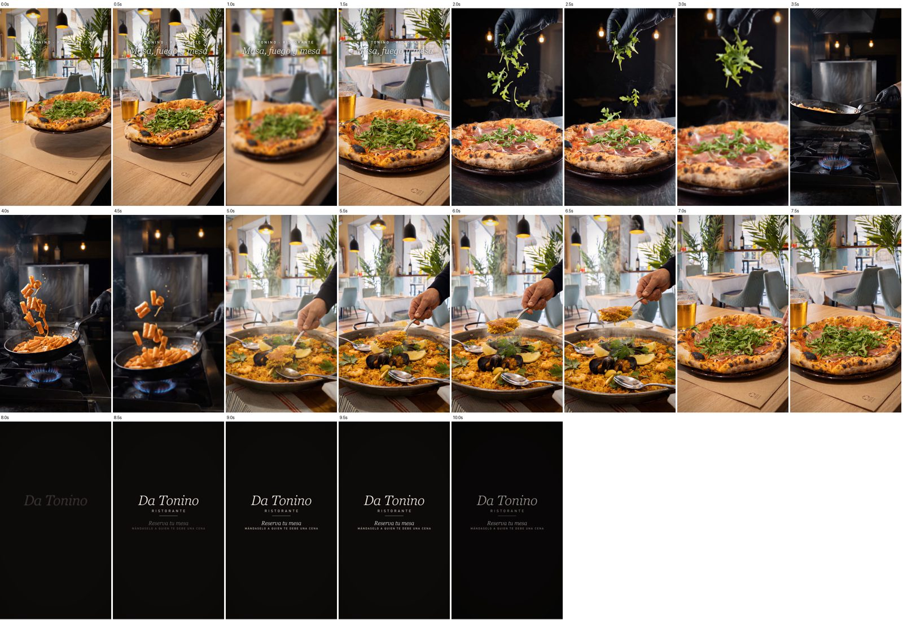
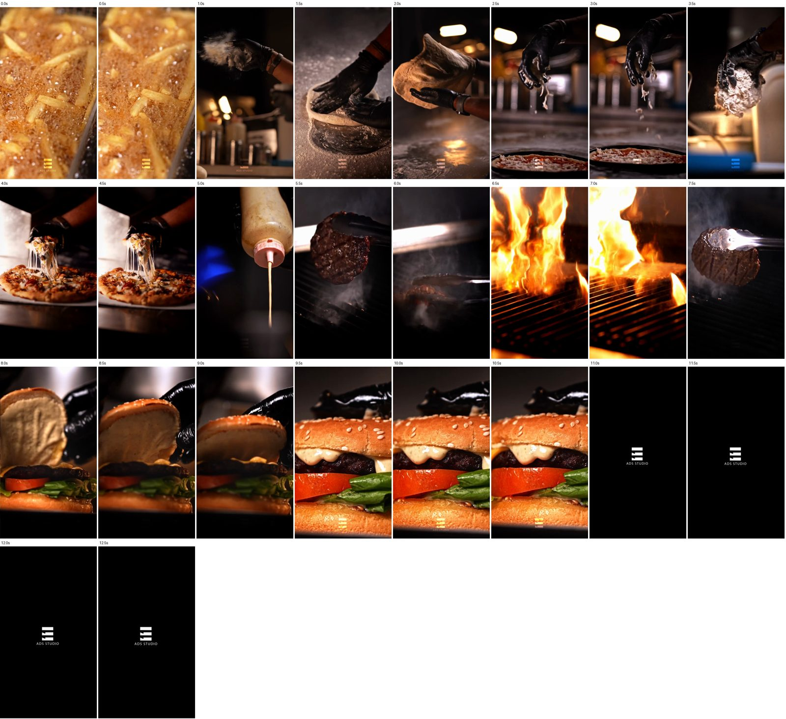
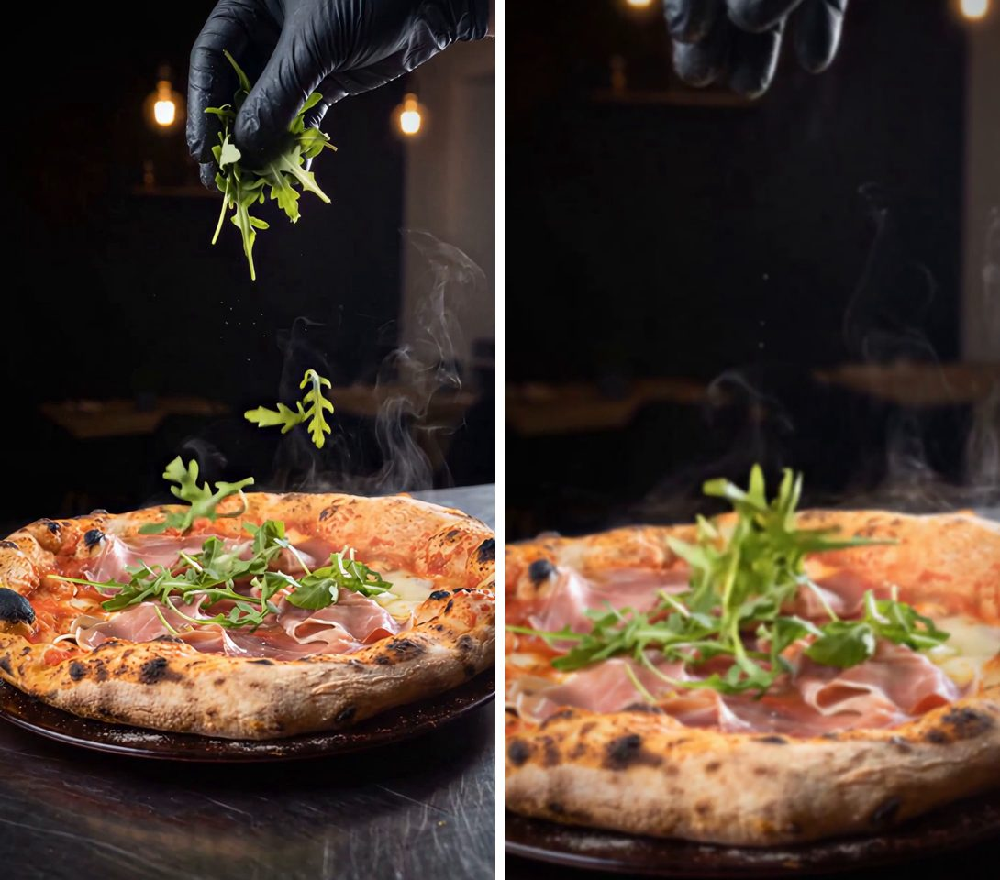
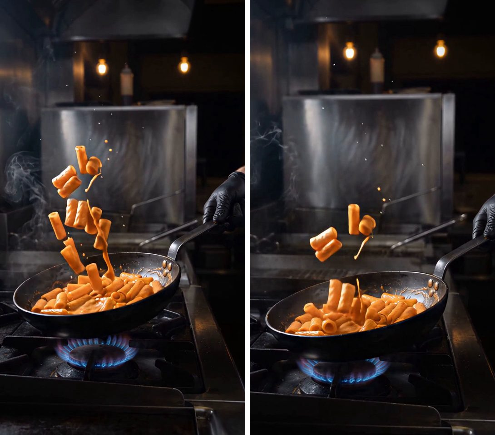
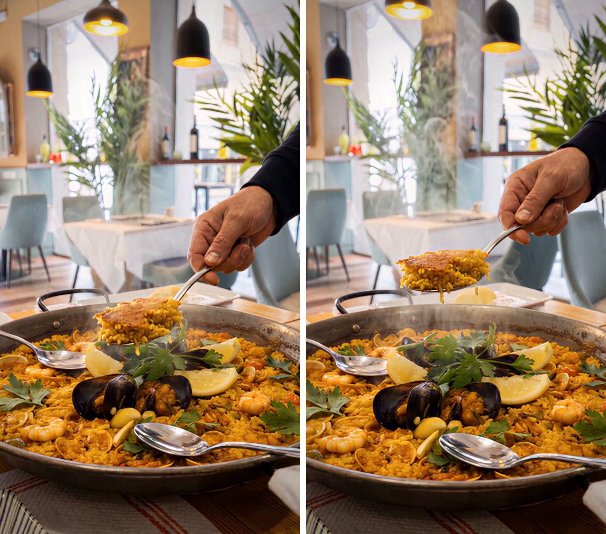
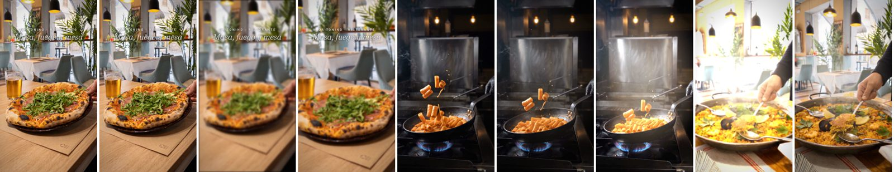
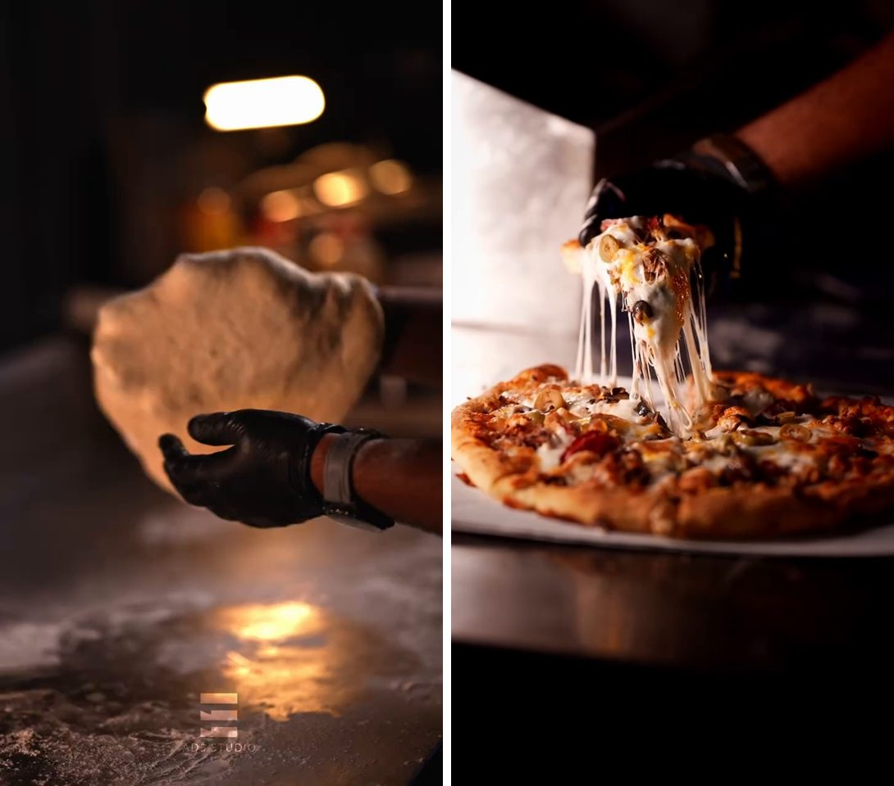
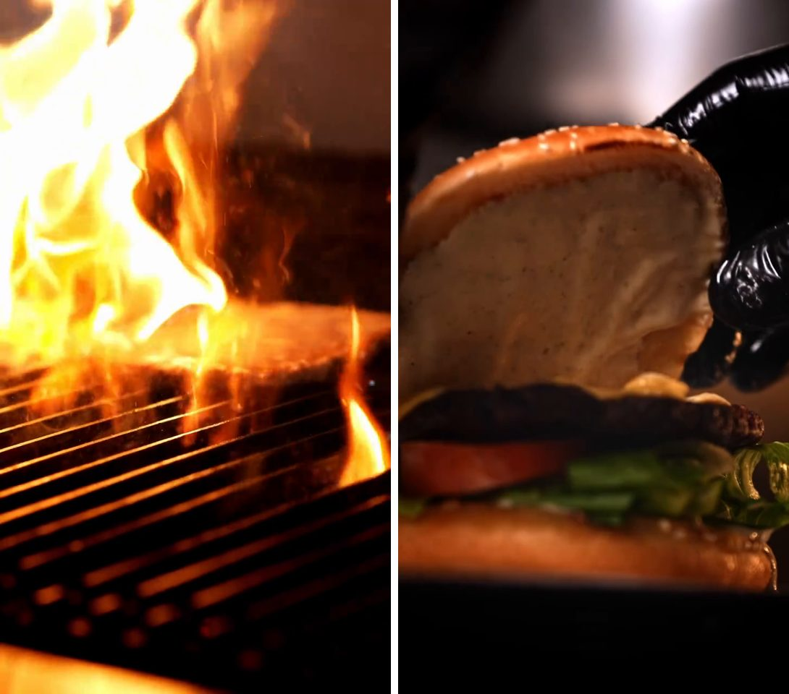

<!-- society-document -->
> **Estado:** vigente · evidencia medida. **Fecha de revisión:** 2026-09-25. **Fecha de evidencia:** 2026-09-25.
> **Ámbito / a quién obliga:** skills de producción de reels (`director`, `directoria`, `openmontage`). Las correcciones que salen de aquí están en [`directoria/references/hosteleria/08-firma-de-rodaje-real.md`](../../skills/directoria/references/hosteleria/08-firma-de-rodaje-real.md).
> **Fuentes:** dos vídeos aportados por Víctor el 2026-09-25; medición con [`medir_realismo.py`](../../skills/openmontage/scripts/medir_realismo.py) ([resultado](medicion.txt)) y revisión fotograma a fotograma.
> **Índice único y autoridad:** [README raíz](../../README.md).

# Da Tonino v3 frente al vídeo de referencia

**Pregunta:** ¿qué hace que el reel de Da Tonino (v3) se note hecho con IA y el de referencia no?

**Respuesta corta:** no es la calidad de cada imagen. El reel generado es **más nítido** que la referencia en todo el encuadre. Lo que lo delata es que **no parece rodado**:

- todo está en foco;
- la luz es plana y las sombras están levantadas;
- la cámara está quieta;
- los objetos flotan sin peso ni desenfoque de movimiento;
- hay transiciones de plantilla;
- no tiene sonido.

La referencia tiene lo contrario en cada uno de esos puntos.

Parte del problema viene de **nuestras propias reglas**: f/4 en todo, «solo slider motorizado, sin cámara en mano» y «la sala levanta las sombras». Resolvieron un fallo concreto (la textura del sushi, 24/09) y, aplicadas a todo el reel, empujan al aspecto de catálogo que el público reconoce como IA.

> **Sobre la referencia.** Lleva la marca «ADS STUDIO» y tiene todas las propiedades de un rodaje de producto. No se ha comprobado si es rodada o generada; da igual para este análisis: esas propiedades son las que hay que reproducir.

## 1. Los dos vídeos

| | Da Tonino v3 (generado) | Referencia |
|---|---|---|
| Formato | 1080 × 1920, 30 fps, 10,0 s | 720 × 1280, 25 fps, 12,9 s |
| Contenido | Pizza en sala → rúcula cayendo sobre pizza (cocina oscura) → rigatoni saltando en sartén → paella servida en sala → pizza → cartela «Da Tonino» | Patatas friendo → harina → estirar masa → masa en el aire → queso rallado → corte de pizza con hilo de queso → salsa → carne a la parrilla → llamarada → montar la hamburguesa → hamburguesa → logotipo |
| Audio | **Pista vacía** (AAC a 2 kb/s, RMS 0) | Música y sonido de cocina (RMS 5.374) |

## 2. Medición

Resultado completo en [`medicion.txt`](medicion.txt). Análisis a 10 fps y 270 px de ancho; las cartelas negras se excluyen.

| Medida | Generado | Referencia | Lectura |
|---|---|---|---|
| Planos (sin cartela) | 6 reales + 2 de transición | 13 | La referencia corta **el doble** |
| Duración media de plano | 1,1 s | **0,8 s** (0,5–1,3 s) | Cadencia de rodaje de producto: un gesto por plano |
| Parte del encuadre en foco | **31 %** (27–47 %) | **18 %** (10–26 %) | La causa principal del «aspecto IA»: profundidad de campo imposible |
| Planos con la cámara quieta | **5** | 2 | La referencia se mueve en casi todos, con movimiento irregular (a mano o gimbal) |
| Negro (percentil 1) | **5,8** | 1,8 | Sombras levantadas: imagen lavada |
| Blanco (percentil 99) | **194** | 234 | Las altas nunca llegan a blanco: no hay brillos especulares |
| Nitidez media (laplaciano) | **1.012** | 262 | El generado tiene **4 veces** más microdetalle, uniforme en todo el encuadre: firma de reescalado, no de óptica |
| Saturación media | 83 | 119 | La referencia tiene color más denso en el producto (fuego, tomate, queso) |
| Audio | **0** | 5.374 | Un reel de comida sin sonido se nota al instante |
| Transiciones de efecto | Desenfoque a 1,0 s, destello a 4,9 s | Solo cortes secos | Las transiciones de plantilla son una marca de montaje automático |

## 3. Qué delata la IA, plano a plano

| Tiempo | Plano | Qué se ve | Por qué se nota |
|---|---|---|---|
| 0,0–1,7 s | Pizza en la sala | La pizza se desliza sobre el plato como un bloque rígido; sala perfectamente iluminada; transición de desenfoque a 1,0 s entre dos versiones del mismo plano | Una pizza napolitana real se comba. El desenfoque de transición no lo usa ningún montador de comida |
| 1,7–3,3 s | Rúcula sobre pizza | Las hojas caen despacio, sin desenfoque de movimiento, y **se quedan de pie** sobre la pizza; el guante desaparece por arriba; el vapor es una voluta fina idéntica a la de la paella | Sin peso: la rúcula real cae rápido, gira y se posa plana. Mismo vapor de plantilla en dos platos distintos |
| 3,3–4,8 s | Rigatoni en la sartén | Tubos idénticos y perfectos, nítidos en el aire, con hilos de salsa como caramelo; llama de gas azul perfecta; la mano no hace el gesto de saltear | Los objetos rápidos sin desenfoque de movimiento son la señal más fiable de vídeo generado. La acción no tiene causa visible |
| 4,8–5,0 s | Transición | Destello blanco | Plantilla |
| 5,0–6,7 s | Paella servida | La mano levanta el arroz a cámara lenta; nube de vapor genérica; luz de día plana | Es el mejor plano (mano real con peso, sala del local), pero sin sonido y sin contraste |
| 1,7–4,8 s frente a 0,0–1,7 y 5,0–8,0 s | Mundos de luz | La cocina es oscura y dramática y la sala luminosa y plana; los dos planos de cocina comparten el mismo fondo de dos bombillas | Dos estéticas sin transición motivada. El fondo repetido delata una plantilla del modelo |

## 4. Qué hace la referencia

1. **Profundidad de campo real.** Solo un plano de 1–3 cm está nítido: el borde de la masa, la punta del queso, el sésamo del pan. Todo lo demás se funde. El ojo lo lee como óptica, no como render.
2. **Luz dura, baja y motivada.** Fondo casi negro, una fuente lateral o trasera dura (se ve la lámpara), contraluz que recorta el humo, la harina y el queso. Negros profundos y altas que llegan a blanco en los brillos de grasa y fuego.
3. **Cámara viva.** Casi todos los planos se mueven un poco y de forma irregular: acompañan la mano, se acercan al gesto. No flotan ni se deslizan.
4. **Verbos de manos.** Cada plano es una acción con causa: enharinar, estirar, lanzar, espolvorear, tirar de la porción, apretar el bote, girar con pinzas, cerrar el pan. Guantes negros, reloj, antebrazo: una persona concreta.
5. **Física con peso.** La harina explota, el queso se estira y cae, la llama desborda, la carne suelta humo. Hay desenfoque de movimiento en lo rápido y cámara lenta solo donde luce (harina, fritura).
6. **Imperfección.** Harina por la mesa, salsa que gotea, bordes quemados, humo que tapa. Nada está colocado.
7. **Montaje de producto.** Cortes secos cada 0,5–1 s, al ritmo de la música, sin una sola transición de efecto; un plano héroe más largo al final (1,7 s) y cartela.
8. **Sonido.** Música con pulso y efectos de cocina. Aunque se vea sin sonido, el ritmo del corte nace de ahí.

## 5. Consecuencias para las skills

| Regla actual | Dónde | Problema | Cambio |
|---|---|---|---|
| «En platos, f/4 con 85 mm» | `directoria/hosteleria/00` §2.2 y `02` §3; `director/02` | Aplicado a todo, deja el 30–45 % del encuadre en foco | f/4 solo para el still de catálogo; en vídeo y planos de acción, plano de foco fino con nombre (**f/1.8–2.8**), y la textura se resuelve en ese plano |
| «Motorised slider moves only, constant speed, no handheld» | `director/04` §2 (prefijo) | Produce cámara que flota o que no se mueve | Cámara a mano o gimbal con microtemblor en planos de proceso; slider solo en el plano héroe |
| «La sala levanta las sombras; que conserven detalle» | `directoria/hosteleria/02` §2 | Negros a 5,8 y altas a 194: imagen lavada | Balance neutro **sí**; contraste bajo **no**. En cocina y proceso, luz dura motivada, fondo oscuro y contraluz |
| «Restraint»: si nada se mueve, el plano se resuelve en montaje | `directoria` principio 11; `director/03` §5 | El empuje digital en montaje sobre un clip quieto parece zoom de plantilla | Restraint significa un solo movimiento con motivo, no cámara muerta |
| Transiciones libres en montaje | `openmontage/02` | Desenfoque y destello | En comida, solo corte seco (y como mucho un *whip* motivado por el gesto) |
| El audio es recomendable | `openmontage/04` | El v3 salió sin audio | Puerta E: **sin sonido no se entrega** |

Las correcciones completas, con bloques de prompt y umbrales, están en [`08-firma-de-rodaje-real.md`](../../skills/directoria/references/hosteleria/08-firma-de-rodaje-real.md).

## 6. La palanca más grande: material real

La referencia gana, sobre todo, porque cada plano es **una acción real de unas manos reales**. Para Da Tonino, la mejora de más impacto no es un prompt mejor: es **una sesión de 20–30 minutos con el móvil en la cocina**. Consiste en:

- grabar 8–10 gestos reales a 4K y 60 fps, con luz de la campana o una lámpara lateral y fondo oscuro: estirar la masa, echar la rúcula, saltear, servir la paella, sacar la pizza del horno;
- grabar el **sonido** de cada uno.

La IA se reserva para lo que no se puede grabar bien: plano héroe de producto, un plano imposible o la sala vacía. Esto ya es regla («si hay metraje real, se usa y no se genera»); aquí se propone convertirlo en **el primer paso del flujo** para los planos de manos y fuego.

## 7. Qué queda por probar

1. **A/B de profundidad de campo.** El mismo keyframe con f/4 y con «only the front edge of the crust in focus, f/2», medido con el script y en una prueba a ciegas con 5 personas en el móvil.
2. **A/B de cámara.** Un plano con «locked-off» y otro con microtemblor de cámara en mano, en Seedance 2.5 y en Kling 3.0.
3. **Suavizado tras el reescalado.** Comprobar si una pasada de grano de película y un ligero desenfoque (0,3–0,5 px) en montaje bajan la nitidez «de reescalado» sin perder textura. Es hipótesis, no está medido.
4. **Reel híbrido de Da Tonino.** Rehacer el v3 con gestos reales grabados en el local y planos generados solo donde haga falta, y medirlo con el script.
