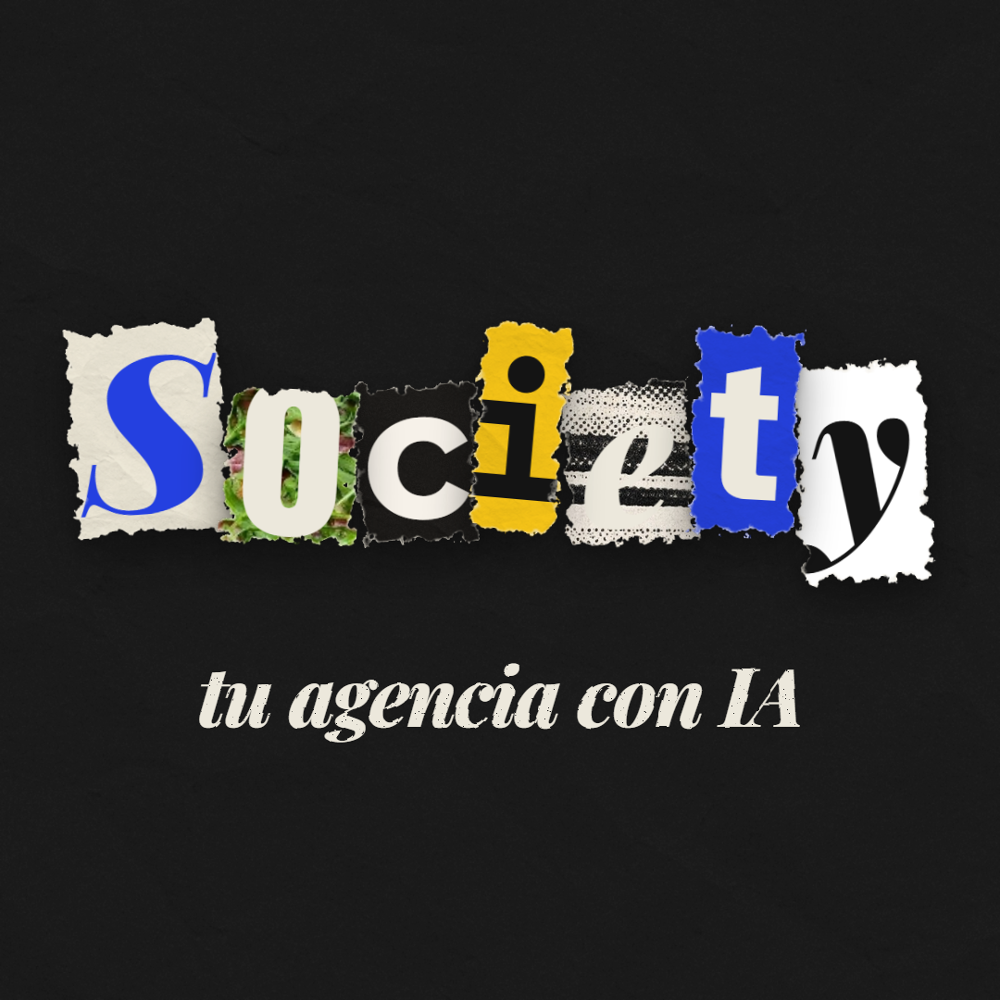

# Exploración de logotipos e iconos de app

## Logotipo oficial (27/09/2026)

Víctor lo fija como logotipo oficial de Society. Es la firma del final de «La pizza que nadie vio»: «Society» con cada letra recortada de un papel distinto, como una nota de recortes, y debajo «tu agencia con IA» en la cursiva, todo sobre tinta.

- Las letras son S cobalto en Playfair sobre papel crudo, o sobre foto, c sobre tinta, i sobre mostaza, e sobre chapa, t sobre cobalto e y sobre blanco.
- Cada recorte tiene el borde rasgado con fibra clara y un giro propio.
- **Fuente única:** [`promo/src/marca/Logo.tsx`](../../promo/src/marca/Logo.tsx), el componente `LogoSociety`. Lo usan la firma del anuncio de la pizza y los vídeos de papel.
- **Imagen fija:** `society-logo-oficial.png` (1080 × 1080). Se regenera con `npm run logo` desde `promo/`.

Todo lo que sigue es la exploración anterior, que queda como histórico.

Generado el 25/09/2026 con Higgsfield, modelo `gpt_image_2_5` (calidad alta, 2K), 2,75 cr por imagen y 11 cr en total. Siguen la paleta y la tipografía de la [guía de identidad](../README.md): papel, cobalto, mostaza al 10 % y tinta; condensada negra + serif cursiva; textura de imprenta.

Son imágenes generadas y sirven de **referencia de estilo, no de piezas finales**. El logotipo que se elija hay que redibujarlo en vector.

| Archivo | Qué es | Trabajo |
| --- | --- | --- |
| [`01-grid-logos-empresa.png`](01-grid-logos-empresa.png) | 9 logotipos de empresa sobre papel | `6e8daa85-f7f9-4074-9c0f-94980562036f` |
| [`02-grid-iconos-app.png`](02-grid-iconos-app.png) | 9 iconos de app | `050d1462-c813-4c55-81cb-6619e1fc43c6` |
| [`03-sistema-logo-e-icono.png`](03-sistema-logo-e-icono.png) | 4 conceptos, cada uno con su logotipo y su icono: la mesa, el bocadillo, el post y el sello | `97151a5b-921f-4dde-bc18-b4093446952e` |
| [`04-grid-modo-oscuro.png`](04-grid-modo-oscuro.png) | Logotipos e iconos alternados sobre tinta | `f40f800b-f321-47c6-a3fc-ec8cdcffbe2c` |
| [`05-variaciones-ganadores.png`](05-variaciones-ganadores.png) | Segunda tanda: 3 variaciones del bocadillo con tenedor, de la S con tenedor y del sello | `eb8bbeb5-38b3-4cec-b9cf-354dddb9ae9e` |
| [`06-grid-logos-nuevos.png`](06-grid-logos-nuevos.png) | 9 logotipos nuevos: comanda «PUBLICADO», O de gráfica, libro de reservas, carta, banderilla, grifo, mesa larga, mesa redonda, toldo | `63dc8b4c-0b91-4052-85a3-b6debaa4efb3` |
| [`07-grid-iconos-nuevos.png`](07-grid-iconos-nuevos.png) | 9 iconos nuevos: comanda, plato con S, silla con bocadillo, timbre, platos en gráfica, copa-bocadillo, mesa con silla cobalto, café con S, tenedor y bocadillo cruzados | `0b9b0eb0-bd6d-4d2a-b635-7c4e1da16585` |
| [`08-aplicaciones-en-el-bar.png`](08-aplicaciones-en-el-bar.png) | La marca aplicada en fotos: móvil, posavasos, vinilo en la puerta, servilletero, delantal, comanda | `092324a0-91c5-466e-bbcc-df4c71712545` |

Segunda tanda: 25/09/2026, mismo modelo y ajustes, 11 cr.

## Lo que funciona mejor

- **El bocadillo con tenedor** (grid 03, concepto 2; icono 2 del grid 02): une las dos ideas de la app en un solo trazo, redes y restaurante. Funciona en pequeño.
- **La S que acaba en tenedor** (grid 04, arriba a la izquierda): es el símbolo D de la guía, pero dice qué es la app.
- **El sello «MÁS MESAS»** (grid 03, concepto 4): habla del resultado, no de la tecnología, y sirve de pegatina.
- **El plato-objetivo** (grid 02, icono 3): la comida y la cámara juntas.

## Lo que falla

- Grid 03, concepto 1: la T convertida en mesa rompe la lectura de «SOCIETY».
- Grid 01·07 y los iconos con el marco de post usan corazón, comentario y avión de papel: recuerdan a Instagram. La guía prohíbe logotipos de otras marcas, así que en diseño final esos iconos tienen que ser propios.
- Grid 04, «SOCIETY» con el plato en la O: los rayos parecen un sol.
- El icono mostaza (grid 02, 5) incumple la regla: la mostaza no puede ser el color principal.
- Grid 08: el móvil enseña iconos de Apple en el dock, y ni en el móvil ni en el posavasos la S acaba en tenedor (sale una brocha). Los platos de la comanda (croquetas, txuletón…) son de relleno.
- Grid 06·12 (libro con S) y 06·15 (grifo) se entienden mal a tamaño pequeño.
